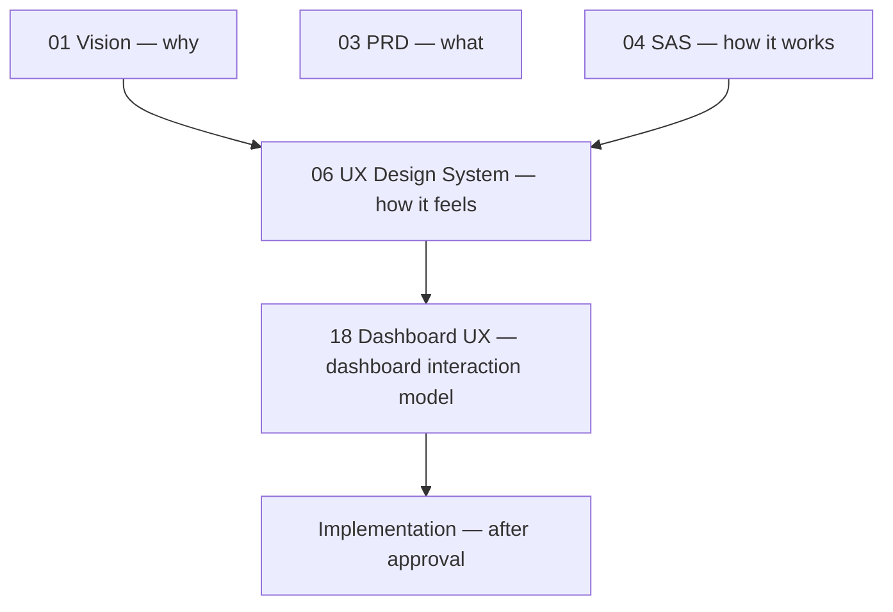

# Nexternel — User Experience & Design System

| Field | Value |
|-------|--------|
| **Document** | User Experience & Design System |
| **Product** | Nexternel |
| **Generation** | **V4** (UX + domain — not a V3.1 patch) |
| **Version** | V4.1.0 |
| **Status** | **Proposal — design authority once approved** |
| **Audience** | Product, design, engineering, QA |
| **Related** | [Vision](01-VISION.md) · **[Domain Model](07-DOMAIN-MODEL.md)** · [Dashboard View UX](18-DASHBOARD-UX-ARCHITECTURE.md) · [SAS](04-SOFTWARE-ARCHITECTURE.md) |
| **Precedence** | On **feel, language, and interaction**, this document equals the SAS. On **wiring and protocols**, SAS wins. |

---

## Executive Summary

Nexternel’s backend architecture is capability-first, protocol-aware, and installer-grade. **Users do not live in that world.** They live in rooms, routines, and moments: “turn off the garden,” “is anyone home,” “why is the hall warm.”

This document is the **design authority** for how Nexternel should feel and behave in the browser. It complements the Software Architecture Specification (how it works) with **how it should feel**.

If the SAS describes the engine, this document describes the **cockpit** — calm, legible, honest, and scalable from five devices to five hundred without turning the UI into a developer console.

**No implementation until Dashboard UX Architecture and this document are approved.**

---

## 1. Purpose & Scope

### 1.1 What this document governs

| In scope | Out of scope |
|----------|----------------|
| UX principles and vocabulary | Fastify route design |
| User-facing language (labels, errors) | MQTT topic layout |
| Interaction patterns (add view, edit, control) | Database migrations |
| Visual system (MUI theme usage, spacing, motion) | Plugin driver internals |
| Accessibility and responsive behaviour | Node-RED flow design |
| Dashboard / view editing flows | ECharts query Flux |

### 1.2 Relationship to other bible documents



---

## 2. Core UX Principles

### 2.1 Room-first, not entity-first

**Default:** Every control is anchored to a **place** or **job** before it is anchored to a device.

| Do | Don’t |
|----|-------|
| “Garden lights” | “Relay 3 on garden-relays” |
| “Kitchen climate” | “temperature.sensor_0” |
| Add view → Garden → Lighting | Add widget → pick from 200 capabilities |

### 2.2 One view, many presentations

Users choose **what** (Lighting) and **how it looks** (Tiles vs Grid). They do not choose among seven switch widget types.

### 2.3 Complexity inside the platform

MQTT, capabilities, drivers, and topic indexes are **never** required knowledge for daily use. Technical detail is **opt-in** (Advanced editor, Devices admin, Troubleshoot).

### 2.4 Calm by default, precise when needed

- **Homeowner mode:** Large touch targets, few words, obvious state (on/off, °C, OK/warning).
- **Installer mode:** Same shell, deeper drawers, export, MQTT in Advanced only.

### 2.5 Honest state (Ignition influence)

- Show **offline**, **stale**, and **unknown** clearly — never fake live data.
- Grey/muted + caption “Offline 2h ago” beats silent wrong values.

### 2.6 Same task, same pattern

Lighting tile, security tile, and climate card share: **title, state, tap action, optional secondary line (room/area).**

### 2.7 Grow without rot

Adding devices must not require re-layout. Views resolve dynamically from scope rules ([18-DASHBOARD-UX-ARCHITECTURE.md](18-DASHBOARD-UX-ARCHITECTURE.md)).

---

## 3. User Vocabulary

### 3.1 Approved terms (UI copy)

| Use | Avoid in default UI |
|-----|---------------------|
| Home | Dashboard (use “Home” tab) |
| Room, Area | Zone (unless user named it) |
| Light, Lights | Switch, relay, GPIO |
| Device | ESP32, Shelly, entity |
| View | Widget |
| View Scope | Widget scope, capability bindings (default) |
| Panel | Switch widget, relay panel |
| Offline | Unavailable (HA jargon) |
| Settings | System configuration |

### 3.2 Installer-only terms (Advanced / Devices / Troubleshoot)

Capability, MQTT topic, driver, sync, YAML, Node-RED, Influx — allowed **only** in installer contexts.

### 3.3 Error messages

| Bad | Good |
|-----|------|
| “Capability command failed” | “Couldn’t turn on Patio light. Device may be offline.” |
| “403 Forbidden” | “You don’t have permission to control this.” |
| “No command topic” | “This light isn’t set up for remote control. Check Devices.” |

---

## 4. Information Architecture

### 4.1 Primary journeys

| Persona | Primary journey | Secondary |
|---------|-----------------|-----------|
| **Sam (home user)** | Home → tap light | Weather, cameras |
| **Alex (installer)** | Devices → add board → Home layout | Settings, backup |
| **Riley (power user)** | Home + custom tabs + Node-RED | Advanced scope, export |
| **Jordan (commercial)** | Role-limited Home + Security view | Users, audit |

### 4.2 Navigation tiers

| Tier | Items | Visibility |
|------|-------|------------|
| **T1 — Daily** | Home tab(s), room sections | All users |
| **T2 — Household** | Settings, Appearance | Signed-in |
| **T3 — Installer** | Devices, Areas, Cameras, Users | Permission-gated |
| **T4 — Diagnostic** | Troubleshoot | Public or signed-in |

**Rule:** T1 never shows T3 concepts.

### 4.3 Depth budget

Maximum **three taps** from Home to any control:

`Home → section → tile` or `Home → section → view → tile` (if grouped).

---

## 5. Dashboard & View Interaction Patterns

### 5.1 Live mode

- Controls are **immediately active** — no separate “run mode.”
- Toggle feedback: optimistic UI + error rollback within 300ms perceived.
- Long-press / secondary: future scene or detail (not V4.1.1 MVP).

### 5.2 Edit mode

| Element | Behaviour |
|---------|-----------|
| Enter edit | Gear on Home; clear “Editing” banner |
| Section | Reorder, collapse, width, room binding |
| View | Drag (handle on title bar), resize (corner) |
| Add view | Function → Scope → Layout dialog |
| Save | Explicit **Save** — no silent auto-save (installer trust) |
| Discard | Revert to last saved document |

### 5.3 Add View pattern (canonical)

```
1. Function   (visual grid of jobs — Lighting, Climate, …)
2. Scope      (room picker; default from section)
3. Layout     (tiles / grid / list — visual thumbnails)
4. Confirm    (preview count: “4 lights”)
```

**Never** show unscoped capability list as step 1.

### 5.4 View editor drawer

- Right drawer, 420px desktop, full-screen mobile.
- Tabs: General | Scope | Appearance | Behaviour | Advanced.
- **Advanced** collapsed by default with warning: “Installer options.”

### 5.5 Empty states

| State | Message pattern |
|-------|-----------------|
| No views in section | “Add a view — e.g. Lighting for this room.” |
| Scope matches nothing | “No lights in Garden yet. Add a device in Devices.” |
| No permission | “Ask an admin for access to control devices.” |

---

## 6. View Library — Presentation Specs

Each **view kind** shares presentation rules. Implementation uses MUI components only ([14-UI-SKINS.md](14-UI-SKINS.md)).

### 6.1 Lighting view appearances

| Layout | Component pattern | Min cell (RGL) |
|--------|-------------------|----------------|
| **Tiles** | `Card` + icon + label + state chip | w3 h3 |
| **Grid** | Compact `Switch` or icon button per row | w4 h3 |
| **List** | `List` + `ListItem` + trailing switch | w4 h4 |
| **Large buttons** | Full-width `Button` / `ToggleButton` | w3 h2 |
| **Compact** | Icon + `Switch` size small | w2 h2 |

**State colour:** `primary` when on (Appearance accent); muted when off — not traffic-light green/red unless security context.

### 6.2 Climate view

- Hero: large temperature + humidity secondary.
- Optional sparkline (Charts view embed or expand).

### 6.3 Security view

- **Alert-first sort:** open > motion active > closed OK.
- Use `warning` / `error` semantic colours for alerts only.

### 6.4 Charts view

- ECharts inside view chrome; same theme merge as V3.
- Default: line for history; gauge appearance for live snapshot.

### 6.5 System / Status views

- Stat typography: `Typography variant="h4"` for primary value.
- No extra unsolicited metrics (per product rule: don’t invent RAM breakdown strings without approval).

---

## 7. Visual Design System (MUI)

### 7.1 Foundation

| Layer | Choice | Notes |
|-------|--------|-------|
| Component library | **Material UI v5+** | Locked in SAS |
| Icons | MUI icons + dashboard icon catalog | Consistent stroke |
| Charts | **Apache ECharts only** | Themed via `chart-theme.ts` |
| Grid | React Grid Layout | 12 columns, rowHeight 56px baseline |

### 7.2 Theme

- **SkinProvider** owns `createTheme(prefs)`.
- User prefs: mode (light/dark), primary accent, gradient background, solid vs frosted panels.
- **Views** use `theme.palette.primary` for “on” state — not hardcoded hex in view bodies.

### 7.3 Spacing scale

Use MUI theme spacing (8px base):

| Context | Spacing |
|---------|---------|
| View internal padding | `p: 1.5` (12px) |
| Tile gap | `gap: 1` (8px) in grid layouts |
| Section accordion padding | `p: 2` |
| Dialog form fields | `Stack spacing={2}` |

### 7.4 Typography

| Role | Variant |
|------|---------|
| View title | `subtitle2` weight 600 |
| Area / room line | `caption` `text.secondary` |
| Tile label | `body2` |
| Tile state | `caption` or badge |
| Hero value (climate) | `h4`–`h5` |

**No** UI/API version strings in widget bodies unless System view (product rule).

### 7.5 Surfaces

- Dashboard cells: `contentSurfaceSx` / skin hooks — frosted on gradient, solid when user selects solid panels.
- Views **must** use skin surface hooks — not raw `Paper` with ad hoc greys.

### 7.6 Colour semantics

| Semantic | MUI token | Use |
|----------|-----------|-----|
| Active / on | `primary` | Lights on, selected |
| OK | `text.primary` | Normal state |
| Warning | `warning` | Stale, attention |
| Error | `error` | Failed command, alert |
| Offline | `action.disabled` | Unavailable controls |

Avoid red/green for every on/off — accessibility and calm aesthetic.

### 7.7 Icons

- Lighting: `Lights`, `Lightbulb`, user-picked from catalog for favourites.
- Climate: `Thermostat`, `WaterDrop`.
- Security: `Security`, `Sensors`.
- Energy: `Bolt`, `ElectricMeter`.

Device type (Shelly vs ESP) **never** gets an icon in homeowner UI.

---

## 8. Motion & Feedback

### 8.1 Motion principles

- **Subtle:** 150–200ms transitions on hover/focus.
- **Purposeful:** Layout drag uses RGL native; no decorative parallax on controls.
- **Respect `prefers-reduced-motion`:** disable non-essential transitions.

### 8.2 Control feedback

| Action | Feedback |
|--------|----------|
| Tap light | Immediate optimistic state; `opacity 0.7` while busy |
| Command fail | Inline caption error + optional snackbar |
| WS reconnect | Silent; no modal |
| Save dashboard | Snackbar “Dashboard saved” |

### 8.3 Loading

- Skeleton inside view while resolving scope (first load).
- Shimmer on charts only — not on switches (switches show last known or offline).

---

## 9. Accessibility

| Requirement | Implementation |
|-------------|----------------|
| Keyboard | All tiles focusable; Space/Enter toggles |
| Labels | `aria-label` from user-facing name, not capability ID |
| Contrast | MUI default palette; test dark + gradient backgrounds |
| Touch targets | Min 44×44px for Tiles layout |
| Screen readers | State: “Patio light, on” / “offline” |
| Focus visible | MUI `focusVisible` rings |

---

## 10. Responsive Behaviour

| Breakpoint | Behaviour |
|------------|-----------|
| **md+** | Side nav, multi-column sections (colSpan 6/4) |
| **sm** | Side nav collapses; sections stack (colSpan 12) |
| **xs** | Full-width sections; Add View full-screen drawer |
| RGL | Single column logical width; ResizeObserver on section |

**Desktop-first** (PRD) but tablet usable — tiles reflow inside view, not infinite horizontal scroll.

---

## 11. Device Independence in UI

### 11.1 Display names

Priority order for control label:

1. User rename (Devices admin)
2. Meaningful entity name (“Waterfall”)
3. Generated friendly (“Garden light 2”) — never “Relay 3” in homeowner mode

### 11.2 Technical details

Shown only when:

- Advanced editor → “Show technical details”
- Devices admin table
- Troubleshoot export

Never on Home tiles by default.

---

## 12. Scalability UX Rules

| Rule | Rationale |
|------|-----------|
| Max ~50 visible controls per view before pagination/virtualise | Readable grid |
| Room picker ≤20 visible rooms; search beyond | No scroll fatigue |
| Section collapse default for inactive rooms | Reduce vertical noise |
| Tabs for major contexts (Home vs Workshop) | Split attention, not split lists |
| Favourites strip optional ≤8 items | Quick access without full list |

---

## 13. Plugin & Skin Integration

### 13.1 Plugins

- Plugins register **view kinds** and **appearances** — not raw “entity widgets.”
- Plugin views must use ThemeProvider tokens and `contentSurfaceSx`.
- Plugin labels follow vocabulary §3.

### 13.2 Skins

- Skins swap **Layout** (nav chrome) and **theme factory** — not per-view CSS hacks.
- Paid local skins ([14-UI-SKINS.md](14-UI-SKINS.md)) may adjust tile radius and density presets.

---

## 14. Comparison — Feel vs Home Assistant

| Dimension | Home Assistant | Nexternel target |
|-----------|----------------|------------------|
| First-run | Integrations, entities | Home with room sections |
| Daily use | Dashboard cards per entity | Views per job per room |
| Add UI | Entity tree or YAML | Function → Scope → Layout |
| Visual tone | Mixed community cards | Unified MUI + skins |
| Power user | YAML + HACS | Advanced + Node-RED |
| Language | Entity, domain, service | Room, light, climate |

We **respect** HA power; we **don’t default** to HA mental load.

---

## 15. Anti-Patterns (Forbidden)

| Anti-pattern | Why |
|--------------|-----|
| Flat capability picker as default add flow | Scales O(n) with devices |
| Seven switch widget types in catalog | Presentation duplication |
| Showing MQTT in tile subtitle | Breaks device independence |
| Auto-saving dashboard without confirmation | Installer distrust |
| New unsolicited metrics on widgets | Product rule |
| Capability ID in user-visible error | Developer vocabulary |
| Copying HA card names (entities, glance, …) | Clone aesthetics |

---

## 16. Design Deliverables Checklist (pre-implementation)

| Deliverable | Owner | Status |
|-------------|-------|--------|
| Dashboard UX Architecture approved | Product | Pending |
| This design system approved | Design | Pending |
| View kind list + icons | Design | Draft in §6 / DUX §3 |
| Add View wireframes | Design | ASCII in DUX §16 |
| Scope JSON schema review | Engineering | Draft in DUX §5 |
| Migration V3→V4 views | Engineering | Outline in DUX §18 |
| Accessibility audit plan | QA | — |

---

## 17. Success Metrics (UX)

| Metric | Target |
|--------|--------|
| Time to first control (new install) | < 15 min installer, < 2 min homeowner daily |
| Dashboard edits after new device | **0** for scoped views |
| Add view dialog steps | ≤ 4 |
| User-facing “capability” strings | 0 in T1 navigation |
| Support tickets “can’t find device” | Down vs entity-first baseline |

---

## 18. Document Maintenance

Update this document when:

- New view kinds ship
- Navigation tiers change
- Theme/skins add new surface modes
- Accessibility policy changes

Do **not** duplicate CHANGELOG entries — link to [CHANGELOG.md](../../CHANGELOG.md) for shipped UX changes.

---

## Related documents

- [18-DASHBOARD-UX-ARCHITECTURE.md](18-DASHBOARD-UX-ARCHITECTURE.md) — interaction model, scope, scale examples
- [14-UI-SKINS.md](14-UI-SKINS.md) — skin implementation
- [01-VISION.md](01-VISION.md) — mission and values
- [02-COMPETITIVE-ANALYSIS.md](02-COMPETITIVE-ANALYSIS.md) — market positioning

---

*Document version: V4.1.1 UX proposal · Status: Awaiting review · No implementation authorized.*
