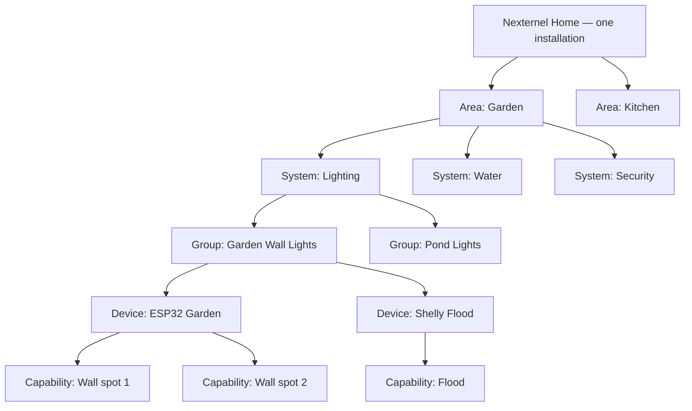
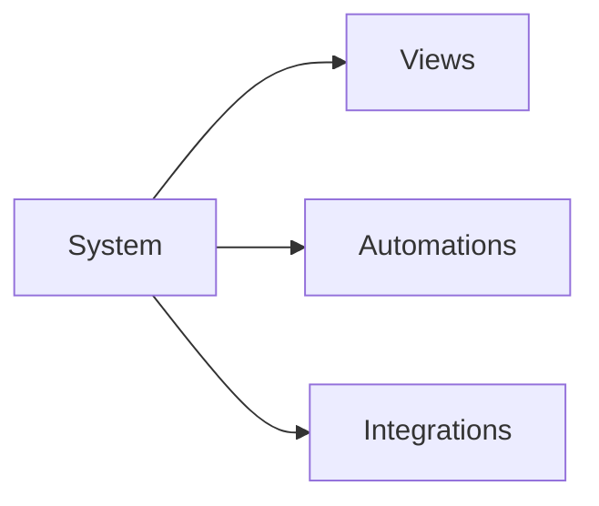

# Nexternel V4 — Domain Model

| Field | Value |
|-------|--------|
| **Document** | Domain Model |
| **Product** | Nexternel |
| **Generation** | **V4** (product generation — not a V3.1 patch) |
| **Version** | V4.1.0 (domain specification) |
| **Status** | **Approved — bible freeze pending catalogue sign-off** |
| **Audience** | Product, architecture, engineering, plugins, UX |
| **Related** | [System Catalogue](08-SYSTEM-CATALOGUE.md) · [View Registry](09-VIEW-REGISTRY.md) · [Capability Standard](10-CAPABILITY-STANDARD.md) · … |
| **Authority** | **This document defines the object model.** UX, API shapes, Postgres schema, plugins, and Views must align here. |

---

## Executive Summary

Nexternel already has a strong **Capability** layer and approved **backend stack**. What was missing is a **user-meaningful hierarchy** between the home and the capability — a layer that survives driver swaps, names things the way humans name them, and makes dashboards **self-maintaining**.

**Home Assistant** thinks: Area → Device → Entity.  
**Many commercial systems** think: Room → Device → Function.  
**Nexternel V4** thinks:

```
Home → Area → System → [Service] → Group → Device → Capability
```

`Service` is **optional** — reserved for V4.1+ when a System needs subdivision (e.g. Energy → Generation / Storage / Cost). V4.0 uses **Group** for lightweight bundling.

The critical addition is **System** — and optional **Group** / **Service** — between place and hardware.

- **Systems own capabilities** (logical ownership).  
- **Devices implement capabilities** (physical/protocol binding).  
- **Areas place** capabilities in the home.  
- **Views (Panels)** display capabilities by **View Scope** — they own nothing.

When an ESP32 garden board is replaced by Shelly, Matter, or KNX, **Garden → Lighting → Garden Wall Lights** still exists. Only the device driver and capability bindings change.

This document is the **foundation** for the entire V4 Development Bible. No dashboard implementation until this model and [24-V4-BIBLE-CONSISTENCY-REVIEW.md](24-V4-BIBLE-CONSISTENCY-REVIEW.md) are approved and the bible is frozen.

---

## 1. Why This Layer Exists

### 1.1 The problem with device-first trees

V3 (and Home Assistant) default to:

```
Garden → ESP32 Garden Relays → Relay 1, Relay 2, Relay 3
Garden → Shelly Flood → switch
Garden → Shelly Pump → switch
```

The user sees **boards and relays**, not **lighting and water**. When hardware changes, **dashboards and mental models break**.

### 1.2 The problem with room-only grouping

Rooms (Areas) answer **where**. They do not answer **what job** a capability serves:

- A relay in the garden might be **lighting**, **water**, or **security**.
- A temperature sensor might be **climate** or **energy**.

Rooms alone cannot own capabilities without ambiguity.

### 1.3 Systems answer “what function in this place”

```
Garden → Lighting → Garden Wall Lights → [devices] → [capabilities]
Garden → Water     → Pond Pump         → [devices] → [capabilities]
Garden → Security  → Motion            → [devices] → [capabilities]
```

**ESP32, Shelly, MQTT, GPIO never appear** in this tree unless the installer opens Devices or Advanced.

---

## 2. The Nexternel Object Model

### 2.1 Hierarchy (canonical)



| Layer | User term | Installer term | Owns |
|-------|-----------|----------------|------|
| **Home** | My home | Installation | Areas, global settings |
| **Area** | Room, Garden, Garage | Area (room record) | Nothing — scopes Systems |
| **System** | Lighting, Climate, Water | System | **Capabilities** (logical) |
| **Group** | Garden Wall Lights, Pond Pump | Group (optional) | Nothing — organises capabilities |
| **Device** | — (hidden by default) | Device | Nothing — **implements** capabilities |
| **Capability** | Light, sensor, lock | Capability | State + command surface |

### 2.2 Ownership rules (normative)

> **A Device provides capabilities. A System gives those capabilities meaning.**

| Assertion | Rule |
|-----------|------|
| Rooms/Areas own capabilities? | **No** — they **scope** them (place) |
| Views/Panels own capabilities? | **No** — they **display** via View Scope |
| Systems own capabilities? | **Yes** — each capability belongs to exactly one **System** per Home |
| Devices own capabilities? | **No** — devices **implement** (host) capabilities |
| Groups own capabilities? | **No** — optional **membership** for UX grouping |
| Services own capabilities? | **No** — optional **subdivision** within a System (future) |

**Meaning example:** `temperature = 23°C` from a sensor is meaningless without System context — the same kind might mean soil warmth (Garden **Environment**), comfort (**Bedroom Climate**), or freezer safety (**Appliances**).

### 2.3 System consumers (not only Views)

Systems are consumed by multiple platform features:

| Consumer | Role | Example |
|----------|------|---------|
| **View** | Dashboard presentation | Water Panel for Garden + `water` System |
| **Automation** | Node-RED flows | IF soil moisture low → open valve |
| **Integration** | External data | Weather forecast → irrigation automation |
| **API** | Future third-party | Read energy System totals |



Node-RED remains the **automation runtime** — not duplicated in the SPA.

### 2.4 Service layer (future — schema reserved)

When a System grows complex, **Services** subdivide without splitting the System:

```
System: energy
 ├── Service: generation   → solar production
 ├── Service: storage      → battery SOC
 ├── Service: consumption  → grid import
 └── Service: cost         → daily tariff
```

```
System: water (Garden)
 ├── Service: irrigation   → pump, valves
 └── Service: monitoring   → tank level, flow
```

| Field | V4.0 | V4.1+ |
|-------|------|-------|
| `capabilities.service_id` | NULL allowed | Optional FK |
| User UI | **Group** names suffice | Service subheaders in Views |

**Do not implement Services in V4.0 MVP** — domain model and schema must **allow** them ([08-SYSTEM-CATALOGUE.md §8](08-SYSTEM-CATALOGUE.md)).

### 2.5 Comparison table

| Concept | Home Assistant | Nexternel V4 |
|---------|----------------|--------------|
| Place | Area | **Area** |
| Logical function | Domain (switch, light) — weak | **System** (Lighting, Water) — strong |
| Sub-organisation | Device | **Group** (optional, user-named) |
| Hardware | Device / integration | **Device** + driver |
| State/command atom | Entity | **Capability** |
| Dashboard tile | Card bound to entity | **View (Panel)** with View Scope |

---

## 3. Entity Definitions

### 3.1 Home

**One Nexternel installation** — the root tenant of config (single-home default; multi-home is a future extension).

| Attribute | Notes |
|-----------|-------|
| Identity | Implicit (one Postgres installation) or explicit `home_id` if multi-site later |
| Contains | Areas, Systems catalogue, Devices, Users, Dashboards |
| User sees | “Home” tab, not “instance id” |

**Maps today:** entire deployment; no separate table in V3.

### 3.2 Area

A **place** in the home: Kitchen, Garden, Garage, Office.

| Attribute | Notes |
|-----------|-------|
| User label | Room name |
| Persistence | `rooms` table (V3) — **rename UX to Area** where user-facing |
| Required? | Strongly encouraged for every device |
| Owns | Nothing |

**Rules:**

- Unassigned devices live in **Unassigned** area — installer queue, not default dashboards.
- Areas **scope** Systems and Views; they do not replace Systems.

### 3.3 System

A **functional domain** in the home: what the capability **does for the user**.

**Platform catalogue (seed):**

| System ID | User label | Typical capability kinds |
|-----------|------------|--------------------------|
| `lighting` | Lighting | switch, brightness, colour |
| `climate` | Climate | temperature, humidity, HVAC |
| `security` | Security | motion, door, lock, alarm, camera |
| `water` | Water | switch (pump), flow, irrigation |
| `energy` | Energy | power, energy, tariff |
| `media` | Media | media_player (future) |
| `automation` | Automation | scenes, scripts (future) |
| `status` | Status | number, text, binary_sensor |

Systems are **stable product vocabulary** — not MQTT domains. Plugins may register additional Systems ([§8](#8-plugin-integration)).

**Ownership:**

- Every **user-facing capability** has `system_id` (required in V4).
- Assignment happens at device onboarding: “Garden + Lighting” or bulk classify.

### 3.4 Group

Optional **user-named bundle** within Area + System:

```
Garden / Lighting / Garden Wall Lights
Garden / Lighting / Pond Lights
Garden / Water / Irrigation
```

| Attribute | Notes |
|-----------|-------|
| Required? | **No** — flat System → Capability is valid |
| User creates? | Yes — “group my deck lights” |
| Persistence | `groups` table (V4) or JSON membership on capabilities |
| Owns | Nothing — **groups capabilities** for display and View Scope |

**Default groups:** installer may auto-suggest from device name or ESPHome entity labels.

### 3.5 Device

Physical or logical **implementation unit**: ESP32 board, Shelly, Glow meter, Octopus virtual device.

| Attribute | Notes |
|-----------|-------|
| User sees | Only in Devices admin (default) |
| Persistence | `devices` table |
| Links | `area_id` (room), `driver` / `firmware_type`, MQTT prefix |
| Owns | Nothing — **hosts** sensors, relays → capabilities |

**Driver swap:** replace device record or re-bind capabilities; **System + Group + user labels** unchanged.

### 3.6 Capability

Atomic **readable or controllable** point — the existing V3 model, extended:

| Field (V4) | Purpose |
|------------|---------|
| `id` | Stable identity |
| `kind` | switch, temperature, power, … |
| `name` | User-facing label |
| `device_id` | Implementation host |
| **`system_id`** | **Logical owner (NEW)** |
| **`group_id`** | Optional UX bundle (NEW) |
| `area_id` | Denormalised from device or explicit override |
| `source_type` / `source_id` | sensor / relay row |
| Bindings | MQTT topics, commands — internal |

**User never browses a flat capability list** on the Home dashboard.

---

## 4. Views and Panels (not Widgets)

### 4.1 Terminology

| V3 (retire in UX) | V4 |
|-------------------|-----|
| Widget | **View** or **Panel** |
| Widget type | **View kind** (Lighting Panel, Energy Panel) |
| Widget config | **View config** |
| Widget scope | **View Scope** |

**Recommendation:** Engineering types `view.lighting`; user strings **“Lighting panel”** or **“Garden lighting”**.

Views are **presentation surfaces** on a dashboard — not owners of data.

### 4.2 View configuration dimensions

| Dimension | Question it answers |
|-----------|-------------------|
| **View Scope** | Which capabilities? (Area + System + optional Group) |
| **Appearance** | Tiles, grid, list, large buttons, … |
| **Behaviour** | Group by, sort, offline visibility, momentary |
| **General** | Title, icon, description |

**Not** “widget scope” — always **View Scope**.

### 4.3 View Scope (normative)

View Scope is a **query** over the domain model:

```
capabilities WHERE
  area_id IN (…)
  AND system_id IN (…)
  AND group_id IN (…)   -- optional
  AND enabled
  AND user_may_control
```

Plus optional **Advanced** include/exclude capability IDs.

**Stored in dashboard JSON** as `config.viewScope` (not `bindings.capabilityId` as default).

Example:

```json
{
  "viewScope": {
    "areaIds": ["garden-uuid"],
    "systemIds": ["lighting"],
    "groupIds": [],
    "inheritSectionArea": true
  },
  "appearance": { "layout": "tiles", "density": "comfortable" },
  "behaviour": { "groupBy": "group", "sort": "name" }
}
```

### 4.4 Dashboard sections

Sections remain **layout containers** with optional `areaId`:

- Section in **Garden** → Add View defaults View Scope to Garden.
- Section does **not** own capabilities — it **inherits** Area into View Scope.

---

## 5. Self-Maintaining Dashboards

### 5.1 Principle

When hardware is added correctly in **Devices**, **Views update automatically**. No dashboard edit.

### 5.2 Onboarding flow (target)

```
1. Installer adds device (Shelly, ESPHome, …)
2. Assign Area: Garden
3. Assign System(s): Lighting
4. Optional: assign Group or create Group
5. Sync capabilities → each cap gets system_id + area_id
6. All Views with View Scope ⊇ { Garden, Lighting } gain new controls
```

### 5.3 What the user does not do

- Pick relay IDs in Add View
- Re-open dashboard when buying another Shelly
- Know capability UUIDs

### 5.4 What Home Assistant still struggles with

HA requires entity lists, auto-entities YAML, or area cards with limited filtering. Nexternel V4 makes **System ownership + View Scope** the **default path** in the product UI — no YAML.

---

## 6. Add View Flow (canonical)

```
+ Add View

1. Choose function  → Lighting | Climate | Security | Water | Energy | Media | …
                    (maps to System)

2. Choose place     → Garden | Kitchen | … 
                    (maps to Area; default from section)

3. Choose appearance → Tiles | List | Buttons | Compact | Large

Done.
```

**No** device picker. **No** relay picker. **No** capability picker (default path).

Optional **Advanced:** manual include/exclude, pick Group, show technical IDs.

---

## 7. Persistence Mapping (V3 → V4)

Design-only — not implemented.

| V4 concept | V3 today | V4 change |
|----------|----------|-----------|
| Home | (implicit) | optional `homes` table later |
| Area | `rooms` | rename user strings; optional `areas` alias |
| System | — | **`systems` catalogue + `capabilities.system_id`** |
| Group | — | **`groups` + `capabilities.group_id`** |
| Device | `devices` | unchanged core |
| Capability | `capabilities` | + `system_id`, `group_id`, denormalised `area_id` |
| View | `WidgetInstance` in JSON | `type: view.*`, `config.viewScope` |
| Dashboard | `v3_dashboards.document` | same table; schema v3 document version |

### 7.1 Proposed tables (illustrative)

```sql
-- System catalogue (seed + plugins)
systems (id TEXT PK, label TEXT, sort_order INT, plugin_id TEXT NULL)

-- Optional user groups
groups (
  id UUID PK,
  area_id UUID FK rooms,
  system_id TEXT FK systems,
  name TEXT,
  sort_order INT
)

-- Capability extension
ALTER capabilities ADD COLUMN system_id TEXT REFERENCES systems(id);
ALTER capabilities ADD COLUMN group_id UUID REFERENCES groups(id) NULL;
ALTER capabilities ADD COLUMN area_id UUID REFERENCES rooms(id) NULL;
```

**Area denormalisation:** `area_id` on capability = `devices.room_id` unless override (e.g. sensor in kitchen belonging to whole-house energy System).

### 7.2 Classification pipeline

```
Device sync (ESPHome / Shelly)
  → create/update sensors/relays
  → sync capabilities
  → apply system rules (default from onboarding + kind hints)
  → assign area from device.room_id
  → optional group from user template
```

Rules live in `@nexternel/domain` + plugin contributions — not in Views.

---

## 8. Plugin Integration

| Plugin contributes | Registers |
|--------------------|-----------|
| New capability kinds | kind + default System mapping |
| New System | `systems` row + classifier rules |
| New View kind | View component + default View Scope hints |
| Driver | Device implementation only — does not bypass System |

**Plugins never register “switch widgets”.** They extend **Systems** and **Views**.

---

## 9. API & Telemetry Alignment (no redesign)

Approved stack unchanged. V4 adds **domain-shaped queries**:

| Endpoint (conceptual) | Purpose |
|-----------------------|---------|
| `GET /capabilities?areaId=&systemId=&groupId=` | Resolve View Scope server-side |
| `POST /views/resolve` | Body: viewScope → capability DTOs for render |
| Device onboarding | `PATCH` device with `areaId` + `defaultSystemIds` |

WebSocket still pushes **capability** updates; Views re-resolve membership on change.

MQTT, Influx, Node-RED: unchanged.

---

## 10. Worked Example — Garden

### 10.1 Structure

```
Home
└── Area: Garden
    ├── System: Lighting
    │   ├── Group: Garden Wall Lights
    │   │   ├── Device: ESP32 Garden (driver: esphome)
    │   │   │   ├── Capability: Spot east
    │   │   │   └── Capability: Spot west
    │   │   └── Device: Shelly Flood (driver: shelly)
    │   │       └── Capability: Flood
    │   └── Group: Pond Lights
    │       └── …
    ├── System: Water
    │   ├── Group: Pond Pump
    │   └── Group: Irrigation
    └── System: Security
        ├── Group: Motion
        └── Group: Cameras
```

### 10.2 Dashboard

| Section | Views |
|---------|-------|
| Garden (areaId=garden) | Lighting Panel (viewScope: garden+lighting, tiles) |
| | Water Panel (viewScope: garden+water, large buttons) |
| | Security Panel (viewScope: garden+security, list) |

### 10.3 ESP32 dies → Shelly replaced

1. Installer removes ESP32 device (or marks disabled).
2. Adds Shelly, same Area + System + Group assignment.
3. Capabilities re-bound; labels preserved where possible.
4. **Lighting Panel unchanged** — View Scope unchanged.

---

## 11. Versioning — V4 Generation

| Layer | Versioning |
|-------|------------|
| **Product generation** | **V4** — new dashboard philosophy, domain model, Views |
| **Shipped builds** | `V4.0.0`, `V4.0.15`, `V4.1.0`, … |
| **V3.1.x** | Maintenance line until V4 cutover |
| **Dashboard document** | `schemaVersion: 3` when View Scope lands |

V4 is **not** “V3.1.1 UX tweak” — it is a **new generation** with migration from V3 widgets to Views.

---

## 12. Migration Principles (V3 → V4)

| V3 | V4 |
|----|-----|
| `switch_*` widgets | Lighting View + appearance |
| `relay_panel` + deviceIds | Lighting View + area + system |
| `stat` | Status View |
| `echarts` | Charts View |
| `bindings.capabilityId` | `viewScope` + optional overrides |
| Room in UI only | Area + System on every capability |
| Category in config.scope | **systemId** in viewScope |

Legacy widgets: read-only render until user “Upgrade to View”.

---

## 13. Glossary (normative)

| Term | Definition |
|------|------------|
| **Home** | One Nexternel installation |
| **Area** | Physical or logical place (room, garden) |
| **System** | Functional domain; **owns capabilities** |
| **Group** | Optional user bundle within Area+System |
| **Device** | Hardware/driver implementation |
| **Capability** | Atomic state/command point |
| **View** | Dashboard presentation surface |
| **Panel** | User-facing name for a View kind |
| **View Scope** | Filter selecting capabilities for a View |
| **Appearance** | Layout/density of a View |
| **Driver** | Protocol implementation (ESPHome, Shelly, …) |

**Deprecated in user copy:** widget, entity, relay (default), entity picker.

---

## 14. Approval Gate

| Checkpoint | Status |
|------------|--------|
| Domain model approved | Pending |
| [24-V4-BIBLE-CONSISTENCY-REVIEW.md](24-V4-BIBLE-CONSISTENCY-REVIEW.md) complete | Pending |
| Bible frozen | **Not yet** |
| Implementation authorized | **No** |

---

## Related documents

- [18-DASHBOARD-UX-ARCHITECTURE.md](18-DASHBOARD-UX-ARCHITECTURE.md) — View UX (must align View Scope with §4.3)
- [06-USER-EXPERIENCE-AND-DESIGN-SYSTEM.md](06-USER-EXPERIENCE-AND-DESIGN-SYSTEM.md) — language and patterns
- [04-SOFTWARE-ARCHITECTURE.md](04-SOFTWARE-ARCHITECTURE.md) — stack (unchanged)
- [24-V4-BIBLE-CONSISTENCY-REVIEW.md](24-V4-BIBLE-CONSISTENCY-REVIEW.md) — cross-document alignment

---

*Nexternel V4 Domain Model · Awaiting approval · No implementation authorized.*
