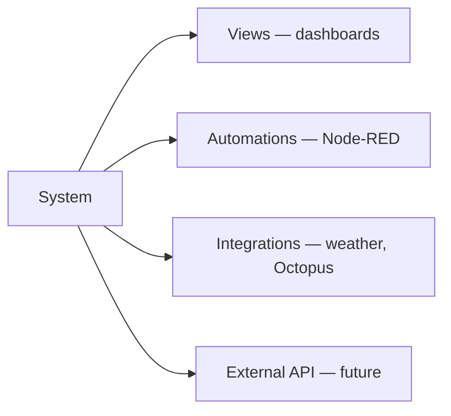

# Nexternel V4 — System Catalogue

| Field | Value |
|-------|--------|
| **Document** | System Catalogue |
| **Product** | Nexternel |
| **Generation** | V4 |
| **Version** | V4.1.0 |
| **Status** | **Frozen** — implementation on `v4.0.0-foundation` |
| **Authority** | Defines every first-class **System** in the domain model |
| **Related** | [Domain Model](07-DOMAIN-MODEL.md) · [View Registry](09-VIEW-REGISTRY.md) · [Capability Standard](10-CAPABILITY-STANDARD.md) |

---

## 1. What a System is

A **System** is a functional domain in the home. **Systems own capabilities** and give raw sensor readings **meaning**.

> **Normative rule:** A **Device** provides capabilities. A **System** gives those capabilities meaning.

| Raw capability | Without System | With System |
|----------------|----------------|-------------|
| `temperature = 23°C` | Meaningless number | **Garden Environment** — soil warmth |
| Same reading | — | **Bedroom Climate** — comfort |
| Same reading | — | **Server Room Monitoring** — ops alert |
| Same reading | — | **Freezer Monitoring** — food safety |

Systems are **stable product vocabulary**. Users and Views speak Systems; drivers change underneath.

---

## 2. Catalogue overview

| System ID | User label | Tier | Suggested panels (UX hints only) | Node-RED automations |
|-----------|------------|------|----------------------------------|---------------------|
| `lighting` | Lights | Core | Controls | Schedules, sunset |
| `climate` | Climate | Core | Status, Climate (profile) | HVAC, comfort |
| `security` | Security | Core | Status, Controls, Security (profile) | Alarm, notify |
| `water` | Water | Core | Controls, Status, Water (profile) | Irrigation, leak |
| `energy` | Energy | Core | Status, Charts, Energy (profile) | Tariff, peak shave |
| `environment` | Environment | Core | Status, Environment (profile) | Air quality alerts |
| `entertainment` | Entertainment / Media | Extended | Controls, Status | Scene triggers |
| `appliances` | Appliances | Extended | Controls, Status | Run completion |
| `garden` | Garden | Deprecated (internal) | — | — |
| `health` | Health & wellness | Future | — | — |
| `network` | Network | Extended | Status | Uptime alerts |
| `vehicles` | Vehicles | Extended | Controls, Status, Energy | Charge windows |

> **Phase 7:** Systems do **not** define or require Panels. “Suggested panels” are optional Add Panel hints — use `panelScope.systemIds` on instances to narrow domain.

**Tier:** Core = V4.0 MVP target · Extended = V4.1+ · Future = catalogue reserved.

Plugins may register additional Systems ([§7](#7-plugin-systems)).

---

## 3. Core systems (detail)

### 3.1 Lighting (`lighting`)

| Field | Value |
|-------|--------|
| **Purpose** | Visible light control — on/off, dim, colour where supported |
| **User question** | “Are the lights on?” / “Turn on garden lights” |

**Default capability kinds:** `switch`, `brightness`, `colour`

**Typical Groups:** Wall lights, ceiling, outdoor, path lights, pond lights

**Default View:** [Lighting Panel](09-VIEW-REGISTRY.md#31-lighting-panel) — tiles, group by Group or Area

**Automation examples (Node-RED):**

- Sunset → turn on path lights  
- Motion + dark → patio on 5 min  
- “All off” at midnight for outdoor lighting System in Area

**Plugins allowed:** Dimmer protocols, DMX, Hue bridge (driver + classify as lighting)

**Not in user UI:** relay, GPIO, MQTT topic

---

### 3.2 Climate (`climate`)

| Field | Value |
|-------|--------|
| **Purpose** | Comfort — temperature, humidity, HVAC state |
| **User question** | “How warm is the kitchen?” |

**Default capability kinds:** `temperature`, `humidity`, `switch` (heating/cool), `enum` (HVAC mode)

**Typical Groups:** Room climate, thermostat, fan

**Default View:** [Climate Panel](09-VIEW-REGISTRY.md#32-climate-panel) — hero temp + humidity, optional history expand

**Automation examples:**

- Frost guard → notify if < 5°C in utility  
- Humidity high → bathroom fan on

**Plugins:** Thermostat integrations, IR blasters (driver only)

---

### 3.3 Security (`security`)

| Field | Value |
|-------|--------|
| **Purpose** | Safety — doors, motion, locks, alarms, cameras (status) |
| **User question** | “Is anything open?” / “Did motion trigger?” |

**Default capability kinds:** `motion`, `door`, `lock`, `alarm`, `binary_sensor`, `camera` (status arm)

**Typical Groups:** Doors, motion zones, cameras, alarm panel

**Default View:** [Security Panel](09-VIEW-REGISTRY.md#34-security-panel) — alert-first list

**Automation examples:**

- Door open > 10 min → notify  
- Motion at night → lights (cross-System: lighting) + notify

**Plugins:** Alarm panels, camera drivers (stream via camera System overlap)

---

### 3.4 Water (`water`)

| Field | Value |
|-------|--------|
| **Purpose** | Water management — pumps, valves, irrigation, tanks, leaks |
| **User question** | “Run the pump” / “Is the tank low?” |

**Default capability kinds:** `switch` (pump/valve), `binary_sensor` (leak, flow), `number` (level, flow rate)

**Future Services** ([Domain Model §2.4](07-DOMAIN-MODEL.md)):

| Service | Capabilities |
|---------|--------------|
| Irrigation | Pump, Valve 1, Valve 2 |
| Monitoring | Tank level, flow rate, soil moisture (or environment crossover) |

**Default View:** [Water Panel](09-VIEW-REGISTRY.md#35-water-panel) — large buttons for actuators, stats for levels

**Automation examples:**

- Soil moisture < 30% AND no rain forecast → start irrigation (Node-RED + weather integration)  
- Tank level low → notify

**Plugins:** Irrigation controllers, flow meters

---

### 3.5 Energy (`energy`)

| Field | Value |
|-------|--------|
| **Purpose** | Power, generation, storage, cost, grid import/export |
| **User question** | “How much am I using?” / “What did solar produce today?” |

**Default capability kinds:** `power`, `energy`, `voltage`, `current`, `number` (cost, tariff)

**Future Services:**

| Service | Capabilities |
|---------|--------------|
| Generation | Solar production, inverter status |
| Storage | Battery SOC, charge rate |
| Consumption | Grid import, circuit monitors |
| Cost | Daily cost, Octopus tariff |

**Default View:** [Energy Panel](09-VIEW-REGISTRY.md#33-energy-panel) — summary + Charts View embed

**Automation examples:**

- Export spike → notify  
- Octopus cheap window → load shift (Node-RED)

**Plugins:** Octopus, Glow, solar inverters

---

### 3.6 Environment (`environment`)

| Field | Value |
|-------|--------|
| **Purpose** | Air quality, soil, weather-local sensors, particulates |
| **User question** | “Is air quality OK?” / “Soil dry?” |

**Default capability kinds:** `temperature`, `humidity`, `co2`, `pm1`, `pm25`, `pm10`, `number` (soil moisture)

**Default View:** [Environment Panel](09-VIEW-REGISTRY.md#36-environment-panel) or plugin air-quality View

**Automation examples:**

- PM2.5 high → notify, trigger air purifier (appliances crossover)  
- Soil moisture → hand off to water System automation

**Plugins:** Air quality packs, weather station drivers

---

## 4. Extended systems (detail)

### 4.1 Entertainment (`entertainment`)

**Purpose:** Media playback, volume, source selection (future drivers).

**Capabilities:** `enum`, `switch`, `number` (volume), media state kinds (future).

**Default View:** Media Panel — transport controls when driver exists.

**Automations:** Scene “Movie night” → dim lighting System + media on.

---

### 4.2 Appliances (`appliances`)

**Purpose:** Washing machine done, oven on, dishwasher state — binary/enum heavy.

**Capabilities:** `binary_sensor`, `enum`, `switch`, `energy` (per appliance).

**Default View:** Appliances Panel — list with state chips.

---

### 4.3 Garden (`garden`)

**Purpose:** Composite outdoor **place + function** — may span lighting, water, environment. Use when user thinks “the garden” holistically.

**Note:** Prefer **Area = Garden** + Systems (lighting, water, environment) for V4.0. `garden` System is for capabilities that are garden-specific but not water/lighting (e.g. lawn mower dock, gate).

**Capabilities:** `switch`, `binary_sensor`, `number`.

**Default View:** Garden Panel — composite scope across Systems in Garden Area.

---

### 4.4 Network (`network`)

**Purpose:** Router, AP, server uptime, LAN health (installer/commercial).

**Capabilities:** `binary_sensor`, `number`, `text` (latency).

**Default View:** Network Panel — status list, offline emphasis.

**Automations:** Device offline > N min → notify.

---

### 4.5 Vehicles (`vehicles`)

**Purpose:** Garage doors, EV charge state, vehicle presence (future).

**Capabilities:** `door`, `switch`, `energy`, `binary_sensor`.

**Default View:** Garage Panel — large buttons for door, charge summary.

---

### 4.6 Health (`health`) — Future

**Purpose:** Wellness devices (future regulatory sensitivity).

**Status:** Catalogue reserved; no V4.0 implementation without product review.

---

## 5. System assignment rules

### 5.1 Onboarding (installer)

When a device is added:

1. Choose **Area** (required for homeowner UX).  
2. Choose one or more **Systems** per capability batch (wizard suggests from kinds).  
3. Optional **Group** names.  
4. Sync → each capability gets `system_id`, `area_id`, optional `group_id`.

Example — ESP32 Garden Controller:

| Capability | Suggested System |
|------------|------------------|
| Pump, Valve 1, Valve 2 | `water` |
| Temperature, Soil moisture | `environment` |

### 5.2 Auto-classification (default hints)

| Capability kind | Default System if unset |
|-----------------|-------------------------|
| `switch` | Context-dependent — **not** default `lighting`; use hints or leave unassigned |
| `temperature`, `humidity` | `climate` or `environment` (context from device name/Area) |
| `power`, `energy` | `energy` |
| `motion`, `door` | `security` |
| `pm25`, `co2` | `environment` |

Installer always confirms — auto is suggest, not silent wrong assignment.

### 5.3 Multi-System prohibition

Each capability has **exactly one** owning System. Cross-System behaviour is **automation** (Node-RED) or **multi-View dashboards**, not duplicate capability rows.

---

## 6. System consumers

Systems are consumed by platform features — not only Views:



| Consumer | Example |
|----------|---------|
| **View** | Water Panel scoped to Garden + `water` System |
| **Automation** | IF `water` System soil moisture < 30% AND forecast dry → valve on |
| **Integration** | Weather service feeds automation; Octopus feeds `energy` System |

Node-RED remains **automation runtime** — flows reference **capability IDs** or future **System-scoped triggers**; Nexternel does not rebuild Node-RED inside the SPA.

---

## 7. Plugin systems

Plugins may register:

```typescript
// Conceptual
registerSystem({
  id: "pool",
  label: "Pool",
  defaultCapabilityKinds: ["switch", "temperature", "binary_sensor"],
  defaultViewKind: "water", // or custom view
  classifyRules: [...],
});
```

Plugin Systems appear in onboarding and Add View like core Systems.

---

## 8. Relationship to Service (future layer)

When Systems grow complex, optional **Services** subdivide without new Systems:

```
energy (System)
 ├── generation (Service)
 ├── storage (Service)
 ├── consumption (Service)
 └── cost (Service)
```

V4.0 implements **Group** as lightweight subdivision. **Service** is reserved in schema (`service_id` nullable) — see [Domain Model §2.4](07-DOMAIN-MODEL.md).

---

## 9. Approval

| Checkpoint | Status |
|------------|--------|
| System catalogue approved | Pending sign-off |
| Maps to View Registry | [09-VIEW-REGISTRY.md](09-VIEW-REGISTRY.md) |
| Maps to Capability Standard | [10-CAPABILITY-STANDARD.md](10-CAPABILITY-STANDARD.md) |

---

*Nexternel V4 System Catalogue · Documentation only · No implementation authorized.*
