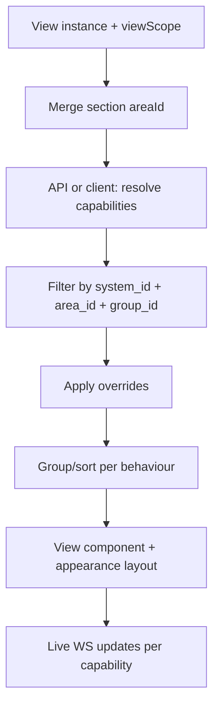

# Nexternel V4 — View / Panel Registry

| Field | Value |
|-------|--------|
| **Document** | Panel Registry (legacy filename `09-VIEW-REGISTRY.md`) |
| **Product** | Nexternel |
| **Generation** | V4 |
| **Version** | V4.2.0 (Phase 7 — System/Panel decoupling) |
| **Status** | **Normative for panel kinds** — see also [25-PANEL-ARCHITECTURE-RULES.md](25-PANEL-ARCHITECTURE-RULES.md) |
| **Related** | [Domain Model](07-DOMAIN-MODEL.md) · [System Catalogue](08-SYSTEM-CATALOGUE.md) · [Dashboard View UX](18-DASHBOARD-UX-ARCHITECTURE.md) |

> **Phase 7 rule:** No System requires a Panel. Panel instances filter via `config.panelScope` (Area, optional System, optional Group). Profile panels (`panel.climate`, etc.) are temporary capability layouts — not System mandates.

---

## 1. What a View is

A **View** (user label: **Panel**) is a dashboard surface that answers one **user question** for a **View Scope** (Area + System + optional Group).

Views **own nothing**. They **query** Systems for capabilities and render with an **Appearance** and **Behaviour**.

| Dimension | Question |
|-----------|----------|
| **View Scope** | Which capabilities? |
| **Appearance** | How do they look? |
| **Behaviour** | How are they grouped, sorted, controlled? |

**Retired V3 concepts:** widget, switch card, relay panel, entity card, gauge widget (as separate catalog entries).

---

## 2. Registry summary

| View kind | User label | Required System(s) | V4.0 tier |
|-----------|------------|-------------------|-----------|
| `view.lighting` | Lighting Panel | `lighting` | Core |
| `view.climate` | Climate Panel | `climate` | Core |
| `view.energy` | Energy Panel | `energy` | Core |
| `view.security` | Security Panel | `security` | Core |
| `view.water` | Water Panel | `water` | Core |
| `view.environment` | Environment Panel | `environment` | Core |
| `view.status` | Status Panel | any (numeric/text) | Core |
| `view.charts` | Charts Panel | any (history) | Core |
| `view.camera` | Camera Panel | `security` or cameras | Extended |
| `view.media` | Media Panel | `entertainment` | Extended |
| `view.garden` | Garden Panel | multi-System in Area | Extended |
| `view.network` | Network Panel | `network` | Extended |
| `view.garage` | Garage Panel | `vehicles` | Extended |
| `view.system` | System Panel | — (host metrics) | Core |
| `view.weather` | Weather Panel | integration | Core |

Plugins register additional View kinds via Plugin SDK.

---

## 3. Core views (specification)

### 3.1 Lighting Panel (`view.lighting`)

| Field | Value |
|-------|--------|
| **User question** | “Control the lights here” |
| **Required Systems** | `lighting` |
| **Supported capability kinds** | `switch`, `brightness`, `colour` |
| **Excluded** | Pumps, sensors (wrong System) |

**Default View Scope:** inherit section Area + `systemIds: [lighting]`

**Default Appearance:** `tiles`, density `comfortable`

**Default Behaviour:** `groupBy: group` (fallback `room`), `sort: name`

**Supported Appearances:**

| Layout | Use |
|--------|-----|
| tiles | Apple Home style |
| grid | Many lights |
| list | Dense |
| large_buttons | Gates / single important light |
| compact | Small grid cells |
| icons_only | Visual panel |

**Control patterns:** toggle; brightness slider when `brightness` capability paired; momentary via Behaviour (`pulseMs`) on Advanced.

**Empty state:** “No lights in {Area}. Add a device and assign Lighting.”

---

### 3.2 Climate Panel (`view.climate`)

| Field | Value |
|-------|--------|
| **Required Systems** | `climate` |
| **Supported kinds** | `temperature`, `humidity`, `switch`, `enum` |

**Default Appearance:** `card` — hero temperature, humidity secondary

**Default Behaviour:** group by Area room; show min/max today optional (Charts expand)

**Charts integration:** tap hero → Charts Panel inline with 24h range

---

### 3.3 Energy Panel (`view.energy`)

| Field | Value |
|-------|--------|
| **Required Systems** | `energy` |
| **Supported kinds** | `power`, `energy`, `voltage`, `current`, `number` |

**Default Appearance:** `card` + embedded Charts (area chart, 24h)

**Default Behaviour:** sum circuits where tagged; show Octopus cost when integration present

**Services (future):** filter by `service_id` — generation vs consumption sections

---

### 3.4 Security Panel (`view.security`)

| Field | Value |
|-------|--------|
| **Required Systems** | `security` |
| **Supported kinds** | `motion`, `door`, `lock`, `alarm`, `binary_sensor` |

**Default Appearance:** `list`, alert-first sort

**Default Behaviour:** open doors first, then active motion, then OK; `critical` tag priority

**Semantic colours:** warning/error for alerts only — not for every on/off

---

### 3.5 Water Panel (`view.water`)

| Field | Value |
|-------|--------|
| **Required Systems** | `water` |
| **Supported kinds** | `switch`, `binary_sensor`, `number` |

**Default Appearance:** `large_buttons` for actuators, `list` for levels/flow

**Default Behaviour:** separate actuators vs monitors (future: Service subdivisions)

**Automation hook:** Node-RED references same capabilities — no View coupling

---

### 3.6 Environment Panel (`view.environment`)

| Field | Value |
|-------|--------|
| **Required Systems** | `environment` |
| **Supported kinds** | `temperature`, `humidity`, `co2`, `pm1`, `pm25`, `pm10`, `number` |

**Default Appearance:** `grid` of metric tiles

**Plugin overlap:** `plugin.air-quality` registers enhanced Environment View variant

---

### 3.7 Status Panel (`view.status`)

| Field | Value |
|-------|--------|
| **Required Systems** | any (installer picks System or omits for “all stats in Area”) |
| **Supported kinds** | `number`, `text`, `enum`, non-switch sensors |

**Default Appearance:** `compact` stat tiles (V3 `stat` successor)

**View Scope:** Area + optional single System; not for switches (use Lighting)

---

### 3.8 Charts Panel (`view.charts`)

| Field | Value |
|-------|--------|
| **Required Systems** | any with history in Influx |
| **Supported kinds** | numeric kinds per [Capability Standard](10-CAPABILITY-STANDARD.md) |

**Engine:** Apache ECharts only (SAS locked)

**Config:** `presetId` (line, area, gauge, …), `range` (1h–7d), multi-series when Scope matches N capabilities

**Default Appearance:** line chart, 24h

**V3 migration:** `echarts` widget type → Charts Panel with same presets

---

### 3.9 System Panel (`view.system`)

| Field | Value |
|-------|--------|
| **Required Systems** | — (host-level, no capability System) |
| **Data source** | `/api/v1/system`, not capability model |

**Default Appearance:** `card` — version, uptime, RAM (fields per product rules)

**Note:** Not scope-driven; exception to System-owned capabilities rule.

---

### 3.10 Weather Panel (`view.weather`)

| Field | Value |
|-------|--------|
| **Data source** | Weather API + optional local sensors in `environment` |

**Default Appearance:** `card` — temp, forecast strip

**Integration consumer** — not only capability-driven

---

## 4. Extended views (summary)

| View | Systems | Notes |
|------|---------|-------|
| **Camera Panel** | `security` | go2rtc streams; picker by camera registry |
| **Media Panel** | `entertainment` | Future media drivers |
| **Garden Panel** | `lighting` + `water` + `environment` in one Area | Composite View Scope (multi-System) |
| **Network Panel** | `network` | Offline-first list |
| **Garage Panel** | `vehicles` | Door + charge |

---

## 5. View configuration schema (normative)

Stored in dashboard JSON (`WidgetInstance` wire format during migration):

```json
{
  "id": "v-garden-water",
  "type": "view.water",
  "title": "Garden water",
  "layout": { "i": "v-garden-water", "x": 0, "y": 0, "w": 4, "h": 3 },
  "bindings": {},
  "config": {
    "viewScope": {
      "inheritSectionArea": true,
      "areaIds": [],
      "systemIds": ["water"],
      "groupIds": []
    },
    "appearance": {
      "layout": "large_buttons",
      "density": "comfortable"
    },
    "behaviour": {
      "groupBy": "group",
      "sort": "name",
      "showOffline": true
    },
    "overrides": {
      "include": [],
      "exclude": []
    }
  }
}
```

---

## 6. View resolution pipeline



**Endpoint (SAS):** `POST /api/v1/views/resolve` or `GET /capabilities` with query filters.

---

## 7. Add View mapping

| Step 1 — Function | Maps to |
|-------------------|---------|
| Lighting | `view.lighting` + System `lighting` |
| Climate | `view.climate` + `climate` |
| Security | `view.security` + `security` |
| Water | `view.water` + `water` |
| Energy | `view.energy` + `energy` |
| Charts | `view.charts` + System picker |
| Status | `view.status` |
| Cameras | `view.camera` |

Step 2 — **Area** (place)  
Step 3 — **Appearance** (layout thumbnail)

No capability picker in default path.

---

## 8. Plugin views

Plugins register:

| Field | Required |
|-------|----------|
| `kind` | `view.pool`, etc. |
| `label` | User Panel name |
| `requiredSystems` | System IDs from catalogue |
| `supportedKinds` | Capability kinds |
| `defaultAppearance` | Layout id |
| `Component` | React + MUI |

Must use View Scope resolver — no hardcoded capability lists in plugin.

---

## 9. V3 widget migration map

| V3 type | V4 View |
|---------|---------|
| `switch`, `switch_*` | Lighting Panel + appearance |
| `relay_panel_*` | Lighting or Water Panel + viewScope |
| `stat` | Status Panel |
| `echarts`, `gauge`, `history` | Charts Panel |
| `weather`, `calendar` | Weather Panel / future Calendar View |
| `system_info` | System Panel |
| `camera` | Camera Panel |
| `plugin.air-quality` | Environment Panel (plugin variant) |
| `plugin.clock` | Accessory View (no System — time) |

---

## 10. Approval

| Item | Status |
|------|--------|
| View Registry approved | Pending |
| Implements Dashboard UX | [18-DASHBOARD-UX-ARCHITECTURE.md](18-DASHBOARD-UX-ARCHITECTURE.md) |
| Systems defined | [08-SYSTEM-CATALOGUE.md](08-SYSTEM-CATALOGUE.md) |

---

*Nexternel V4 View Registry · Documentation only · No implementation authorized.*
