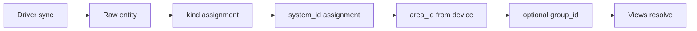

# Nexternel V4 — Capability Standard

| Field | Value |
|-------|--------|
| **Document** | Capability Standard |
| **Product** | Nexternel |
| **Generation** | V4 |
| **Version** | V4.1.0 |
| **Status** | **Frozen** — Phase 1 domain types shipped |
| **Purpose** | Universal device language — Nexternel’s typed contract above drivers |
| **Related** | [Domain Model](07-DOMAIN-MODEL.md) · [System Catalogue](08-SYSTEM-CATALOGUE.md) · [SAS § Capability Model](04-SOFTWARE-ARCHITECTURE.md) |

---

## 1. Purpose

Drivers (ESPHome, Shelly, Matter, …) speak vendor formats. **Capabilities** are how Nexternel speaks uniformly.

This document defines:

- Every **capability kind** (`kind`)
- **State shape** (value, unit, quality, timestamps)
- **Command vocabulary** where applicable
- **System assignment** hints
- **View** compatibility

Implementations: `@nexternel/domain` (Zod schemas), API DTOs, UI renderers, Node-RED reference nodes (future).

---

## 2. Universal capability record (V4)

| Field | Type | Required | User-visible |
|-------|------|----------|--------------|
| `id` | UUID | yes | Advanced only |
| `kind` | CapabilityKind | yes | As label type hint |
| `name` | string | yes | **Primary label** |
| `deviceId` | UUID | yes | Advanced only |
| **`systemId`** | string | yes (V4) | As System name |
| **`areaId`** | UUID | yes (V4) | As Area name |
| `groupId` | UUID | no | As group heading |
| `unit` | string | no | Shown with value |
| `state.value` | typed per kind | — | **Primary display** |
| `state.quality` | good/stale/unknown/error | — | Offline UX |
| `state.updatedAt` | ISO datetime | — | Stale captions |
| `hasCommand` | boolean | — | Control affordance |
| Binding | internal | — | Never default |

---

## 3. State envelope (all kinds)

```typescript
// Conceptual — aligns with packages/domain CapabilityState
{
  value: unknown;      // kind-specific — see §4
  unit?: string;
  quality: "good" | "stale" | "unknown" | "error";
  updatedAt?: string;  // ISO-8601
}
```

| Quality | UI behaviour |
|---------|--------------|
| `good` | Normal display |
| `stale` | Muted + “Offline” / last seen |
| `unknown` | “—” until first message |
| `error` | Error caption, no fake value |

---

## 4. Capability kinds (catalog)

### 4.1 `temperature`

| Property | Type | Notes |
|----------|------|-------|
| `value` | number | Celsius default; unit may override |
| `unit` | `"°C"` \| `"°F"` \| … | Display |
| `precision` | number | UI decimal places (default 1) |
| `min` / `max` | number | Optional sane bounds for gauges |
| Commands | none | Read-only |

**Default Systems:** `climate`, `environment`  
**Views:** Climate, Environment, Charts, Status

---

### 4.2 `humidity`

| Property | Type | Notes |
|----------|------|-------|
| `value` | number | 0–100 % |
| `unit` | `%` | |
| Commands | none | |

**Default Systems:** `climate`, `environment`

---

### 4.3 `pressure`

| Property | Type | Notes |
|----------|------|-------|
| `value` | number | hPa typical |
| Commands | none | |

**Default Systems:** `environment`, `climate`

---

### 4.4 `switch`

| Property | Type | Notes |
|----------|------|-------|
| `value` | boolean | `true` = on |
| Commands | `on`, `off`, `toggle` | REST → MQTT |
| Momentary | behaviour | `pulseMs` in View Behaviour, not kind |

**Default Systems:** `lighting`, `water`, `climate` (heating), `appliances`  
**Views:** Lighting, Water, Security (lock overlap)

**Display:** never “Relay N” in homeowner mode if name assigned.

---

### 4.5 `brightness`

| Property | Type | Notes |
|----------|------|-------|
| `value` | number | 0–100 or 0–255 (driver maps) |
| Commands | `set` (number) | |

**Default Systems:** `lighting`  
**Views:** Lighting Panel (slider)

---

### 4.6 `colour`

| Property | Type | Notes |
|----------|------|-------|
| `value` | object | `{ r, g, b }` or hue/sat (driver normalises) |
| Commands | `set` | Future V4.1+ |

**Default Systems:** `lighting`

---

### 4.7 `motion`

| Property | Type | Notes |
|----------|------|-------|
| `value` | boolean | `true` = motion active |
| Commands | none | |

**Default Systems:** `security`

---

### 4.8 `door`

| Property | Type | Notes |
|----------|------|-------|
| `value` | boolean | `true` = open (convention documented per driver) |
| Commands | none | Some drivers: lock pair |

**Default Systems:** `security`, `vehicles`

---

### 4.9 `lock`

| Property | Type | Notes |
|----------|------|-------|
| `value` | boolean or enum | locked / unlocked |
| Commands | `lock`, `unlock` | Future |

**Default Systems:** `security`

---

### 4.10 `binary_sensor`

| Property | Type | Notes |
|----------|------|-------|
| `value` | boolean | Generic on/off sense |
| `subtype` | string optional | leak, smoke, connectivity — metadata |
| Commands | none | |

**Default Systems:** context-based (`security`, `water`, `network`)

---

### 4.11 `number`

| Property | Type | Notes |
|----------|------|-------|
| `value` | number | |
| `min` / `max` / `step` | optional | For sliders |
| Commands | optional `set` | |

**Default Systems:** `water` (level), `energy` (cost), `environment`

---

### 4.12 `power` / `energy` / `voltage` / `current`

| Kind | Value | Unit examples |
|------|-------|---------------|
| `power` | number | W, kW |
| `energy` | number | kWh |
| `voltage` | number | V |
| `current` | number | A |

Commands: none (read-only typical).

**Default Systems:** `energy`  
**Views:** Energy, Charts, Status

---

### 4.13 `co2`, `pm1`, `pm25`, `pm10`

| Property | Type | Notes |
|----------|------|-------|
| `value` | number | µg/m³ or ppm for CO₂ |
| Commands | none | |

**Default Systems:** `environment`  
**Views:** Environment Panel, air-quality plugin

---

### 4.14 `battery`

| Property | Type | Notes |
|----------|------|-------|
| `value` | number | 0–100 % |
| Commands | none | |

**Default Systems:** `security` (device health), `network`

---

### 4.15 `enum`

| Property | Type | Notes |
|----------|------|-------|
| `value` | string | Closed set in metadata |
| `options` | string[] | Config plane |
| Commands | `set` (enum value) | HVAC modes |

**Default Systems:** `climate`, `appliances`, `entertainment`

---

### 4.16 `text`

| Property | Type | Notes |
|----------|------|-------|
| `value` | string | |
| Commands | rare `set` | |

**Default Systems:** `network`, `status`

---

### 4.17 `json`

| Property | Type | Notes |
|----------|------|-------|
| `value` | object | Plugin-defined |
| Commands | plugin-defined | Advanced |

**Default Systems:** plugin-assigned

---

### 4.18 `camera`

| Property | Type | Notes |
|----------|------|-------|
| `value` | stream reference / status | Not inline video in capability value |
| Commands | arm/disarm optional | |

**Default Systems:** `security`  
**Views:** Camera Panel (go2rtc)

---

### 4.19 `alarm`, `weather`, `gps`

Reserved kinds — catalogue aligned with `packages/domain` for forward compatibility. Full spec when drivers ship.

---

## 5. Commands (REST → driver)

| Command | Applies to | API body |
|---------|------------|----------|
| `on` / `off` / `toggle` | `switch` | `{ "value": true/false/"toggle" }` |
| `set` | `number`, `brightness`, `enum`, `colour` | `{ "value": <typed> }` |
| `pulse` | `switch` (momentary) | `{ "value": "pulse", "pulseMs": 500 }` — V4 API extension |

Authorization: `controlRelays` or finer permissions per System (future).

---

## 6. Classification pipeline



**Rules document:** [08-SYSTEM-CATALOGUE.md §5](08-SYSTEM-CATALOGUE.md)

---

## 7. History (Influx) mapping

| Capability field | Influx tag |
|------------------|------------|
| Device slug | `device` |
| Entity id | `entity_id` |
| Measurement | `sensor_reading` |
| Field | `value` |

History eligibility: numeric kinds per §4; switches optionally excluded from charts default.

---

## 8. Comparison to other “universal languages”

| Platform | Equivalent |
|----------|------------|
| Home Assistant | Entity + domain |
| Matter | Clusters / attributes |
| Apple Home | Service + characteristic |
| **Nexternel** | **kind** + **System** + typed **state** |

Nexternel adds **System ownership** so the same `temperature` kind is unambiguous in UI.

---

## 9. Versioning

| Change | Version bump |
|--------|--------------|
| New kind | Minor domain package + this doc |
| New command verb | API minor + this doc |
| Breaking state shape | Major — migration ADR |

Wire format remains JSON; Zod in `@nexternel/domain`.

---

## 10. Approval

| Item | Status |
|------|--------|
| Capability Standard approved | Pending |
| Domain package alignment | `@nexternel/domain` update in implementation phase |

---

*Nexternel V4 Capability Standard · Documentation only · No implementation authorized.*
