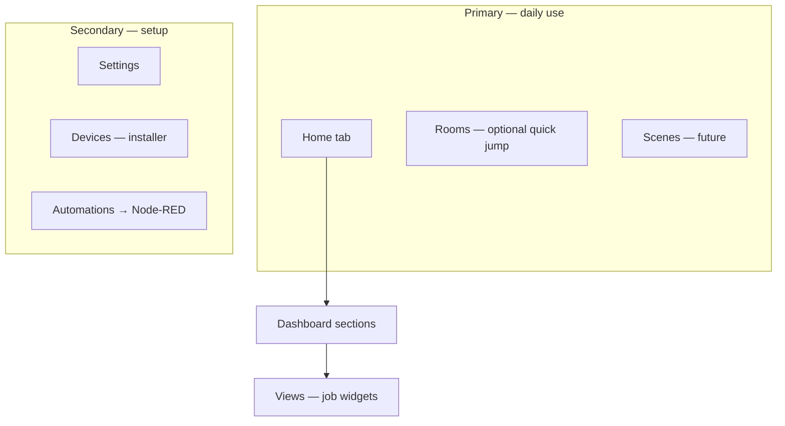
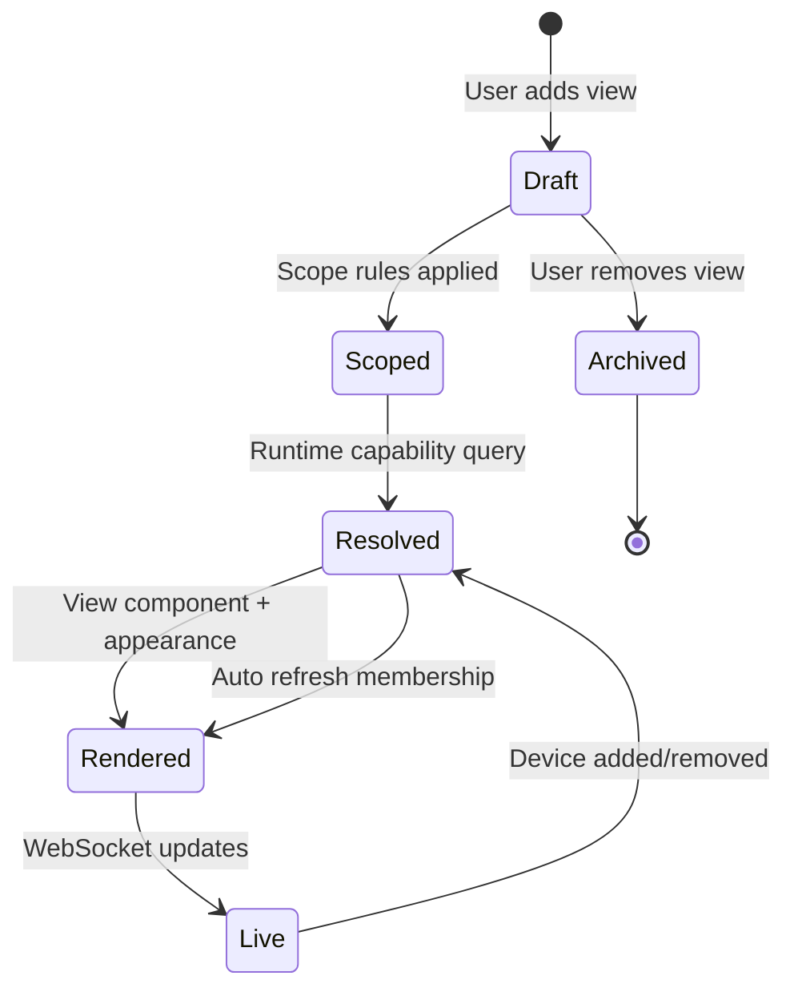
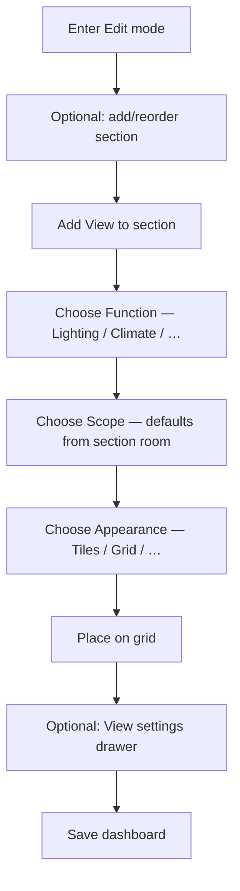
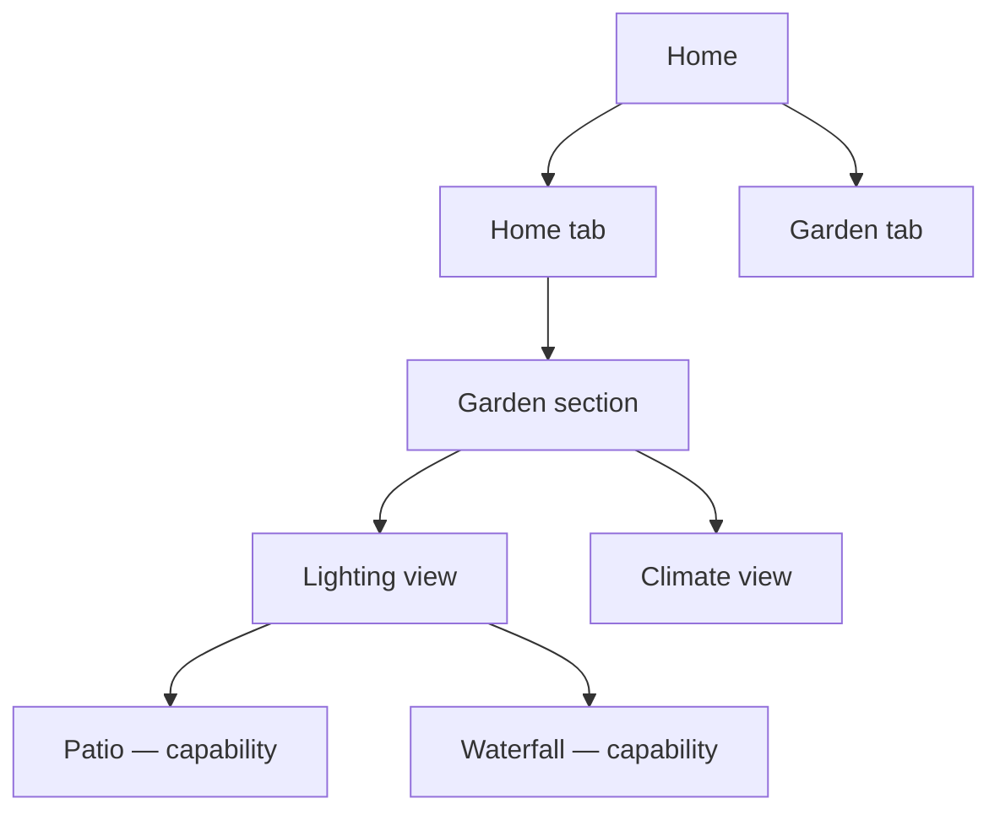
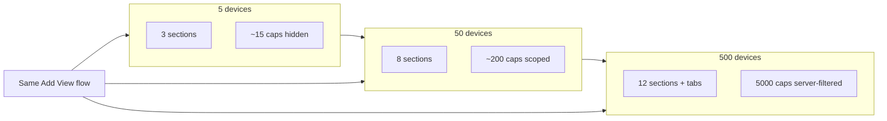

# Nexternel V4 — Dashboard & View UX Architecture

| Field | Value |
|-------|--------|
| **Document** | Dashboard & View UX Architecture |
| **Product** | Nexternel |
| **Generation** | **V4** |
| **Version** | V4.1.0 |
| **Status** | **Approved direction — no implementation until bible frozen** |
| **Baseline implementation** | V3.1.x (entity-first widgets — superseded by this doc) |
| **Audience** | Product, UX, engineering, external architects |
| **Related** | **[Domain Model](07-DOMAIN-MODEL.md)** · [UX Design System](06-USER-EXPERIENCE-AND-DESIGN-SYSTEM.md) · [SAS](04-SOFTWARE-ARCHITECTURE.md) · [Consistency Review](24-V4-BIBLE-CONSISTENCY-REVIEW.md) |
| **Governing rule** | **Backend stack is frozen.** **Domain model + this doc** define the dashboard experience. |

---

## Executive Summary

Nexternel V3 shipped a capable dashboard engine: JSON documents, React Grid Layout, ECharts, capability bindings, live WebSocket updates. It works. It also increasingly resembles **entity-first** platforms: pick a widget type, pick a capability, pick a style — repeat for every relay.

**V4** defines the dashboard interaction model on top of [07-DOMAIN-MODEL.md](07-DOMAIN-MODEL.md):

- Users organise around **Home → Area → System** — not protocols, drivers, or capability IDs.
- **Views (Panels)** replace V3 widgets. A View has a **System** (Lighting, Water, Security) and **View Scope** (Area, optional Group).
- **Systems own capabilities**; Views display them via View Scope — Views own nothing.
- **Dynamic discovery** resolves capabilities at runtime. New devices assigned Area + System appear without dashboard edits.
- **One View, many Appearances** — not seven switch widget types.

The capability model, MQTT, telemetry, and Postgres JSON storage **remain**. What changes is domain assignment (`system_id`), `config.viewScope`, Add View flows, and section filtering.

**No production code until [24-V4-BIBLE-CONSISTENCY-REVIEW.md](24-V4-BIBLE-CONSISTENCY-REVIEW.md) is signed off.**

---

## 1. Dashboard Philosophy

### 1.1 What users think

Users do **not** think:

> “I need `capability switch.light_17` on a `relay_panel_list` widget.”

Users think:

> “Turn on the garden lights.”  
> “Is the office warm enough?”  
> “Did I leave the garage open?”

The dashboard must speak **human intent**, not integration internals.

### 1.2 What stays internal

| Internal (never default in UI) | User-facing (default in UI) |
|--------------------------------|-----------------------------|
| Capability ID | Light, fan, sensor, lock |
| MQTT topic | Device friendly name |
| ESPHome / Shelly / Matter | — (hidden unless Advanced) |
| Driver | — |
| Entity domain | Category (Lighting, Climate) |
| `kind: switch` | On / Off, Brightness (when applicable) |

Capabilities are the **engine**. They are not the **interface**.

### 1.3 Design north stars

| Reference | What we borrow | What we do not copy |
|-----------|----------------|---------------------|
| **Apple Home** | Room-first, calm tiles, task grouping | Apple-only hardware lock-in |
| **Philips Hue** | Lighting as a first-class “job” | Hue cloud hub |
| **Tesla** | Polish, status at a glance, few choices | Automotive domain |
| **Sonos** | “What’s playing here?” room context | Media-only scope |
| **Home Assistant** | Area → device → entity hierarchy for *discovery* | Entity-first add-card flows |
| **Ignition SCADA** | Reliability, explicit state, no silent failure | Industrial visual language |
| **Material Design** | Consistent components (MUI) | Generic MD admin aesthetic |

**Nexternel goal:** Apple Home **simplicity** + Home Assistant **flexibility** (under Advanced) + self-hosted **reliability**.

### 1.4 Complexity budget

| Layer | Complexity allowed |
|-------|-------------------|
| Backend (capabilities, drivers, MQTT) | High — this is our moat |
| Dashboard JSON rules | Medium — structured, versioned |
| Default user UI | **Low** — always |

**Rule:** No screen grows linearly with device count. Lists become **filtered trees**, **scoped panels**, or **paginated groups** — never one flat scroll of 500 rows.

---

## 2. Navigation Hierarchy

### 2.1 Mental model (user)

Aligns with [07-DOMAIN-MODEL.md](07-DOMAIN-MODEL.md):

```
Home
 └── Area (Garden, Kitchen, …)
      └── System (Lighting, Water, Security, …)
           └── Group (optional — Garden Wall Lights, Pond Pump)
                └── View (Panel) — Lighting Panel, Water Panel
                     └── Controls (capabilities — hidden layer)
```

### 2.2 Application navigation (SPA)



| Nav item | Role | V4.1.1 |
|----------|------|--------|
| **Home** | Default dashboard(s), room sections, views | Primary |
| **Rooms** | Room index → filtered home or room dashboard | Should |
| **Devices** | Installer/admin device CRUD | Existing admin |
| **Settings** | Appearance, system, backup | Existing |
| **Automations** | Deep link Node-RED | Existing |

**Deprecate as primary concepts:** “Widget type catalog with 40 entries,” “Capability picker as default path.”

### 2.3 Dashboard tabs

Multiple dashboards remain (e.g. **Home**, **Garden**, **Workshop**). Tab bar is **context**, not entity storage.

- Default tab = **Home** (clean `/` URL preserved).
- Installer may add **Garden** tab with garden-scoped sections only.

---

## 3. View Philosophy — Panels, Not Entity Widgets

### 3.1 Terminology shift

| V3 term | V4 term | Meaning |
|---------|---------|---------|
| Widget | **View** / **Panel** | A surface on the dashboard |
| Widget type (`switch_icon`) | **View kind** — maps to **System** | Lighting Panel, Energy Panel |
| Widget config style | **Appearance** | Tiles, grid, list, … |
| Bindings (`capabilityId`) | **View Scope** (+ optional overrides) | Area + System + Group filter |

*Wire format may keep `WidgetInstance` during migration; product language is **View** and **View Scope**.*

### 3.2 One view = one job

**Function views (V4.1.1 core library):**

| View kind | User label | Resolves capabilities |
|-----------|------------|------------------------|
| `lighting` | Lighting | Switches/dimmers tagged or classified as lights |
| `climate` | Climate | Temperature, humidity, HVAC-related |
| `heating` | Heating | Heating switches, thermostats, boiler |
| `power` | Power | Power, energy, current sensors |
| `security` | Security | Doors, motion, alarms, locks |
| `garage` | Garage | Scoped garage room + garage-class devices |
| `garden` | Garden | Outdoor / garden scope |
| `media` | Media | Media players (future driver) |
| `weather` | Weather | Weather service + local sensors |
| `energy` | Energy | Energy totals, Octopus, Glow |
| `camera` | Cameras | Camera streams in scope |
| `system` | System | Host health, API, disk |
| `charts` | Charts | History ECharts by scope |
| `status` | Status | Stat tiles for numeric/text in scope |

**Not:** `switch`, `switch_icon`, `switch_momentary`, `relay_panel_list`, …

### 3.3 One view, many presentations

Each view kind supports **Appearance** modes (not separate catalog entries):

| Appearance | Use case |
|------------|----------|
| **Tiles** | Apple Home–style large tap targets |
| **Grid** | Many lights in compact grid |
| **List** | Dense scan-friendly |
| **Large buttons** | Garage, gates, momentary actions |
| **Compact** | Sidebar or small cells |
| **Icons only** | Visual wall panels |
| **Card** | Single-room hero card with summary |

Example — **one** Lighting view:

```
kind: lighting
scope: { roomId: "garden" }
appearance: { layout: "tiles", density: "comfortable" }
```

Switching to `layout: "grid"` is an editor change — not a new widget type.

### 3.4 Specialised presentations (behaviour, not type)

| Need | Mechanism |
|------|-----------|
| Momentary pulse (gate) | **Behaviour** on a control: `pulseMs` on a lighting/security view item, or Advanced override |
| Gauge / chart | **Charts view** with `appearance: gauge` or chart preset — still scope-driven |
| Single favourite light | Scope rule + `include: [one cap]` or Favourite tag |

---

## 4. Widget Lifecycle



| Stage | Owner | Persistence |
|-------|-------|-------------|
| **Define** | User in edit mode | `document.sections[].widgets[]` |
| **View Scope** | User + section defaults | `config.viewScope` — Area + System + Group ([07-DOMAIN-MODEL.md](07-DOMAIN-MODEL.md)) |
| **Resolve** | UI runtime (+ optional API assist) | Ephemeral capability list |
| **Render** | View component registry | — |
| **Live** | Telemetry engine | WS + cache |
| **Evolve** | Platform | New devices match rules → auto appear |

**No lifecycle step requires picking capability IDs in the default path.**

---

## 5. View Scope Model

View Scope is how a View selects capabilities from the domain model. **Views own nothing; Systems own capabilities.**

### 5.1 Scope dimensions

| Dimension | Domain layer | Example |
|-----------|--------------|---------|
| **Area** | Area | Garden, Kitchen |
| **System** | System | `lighting`, `water`, `security` |
| **Group** | Group (optional) | Garden Wall Lights, Pond Pump |
| **Dashboard section** | Implicit Area | Section `areaId` → default View Scope |

Legacy filters (capability `kind`, tags) are **installer Advanced** only — default path is Area + System.

### 5.2 Proposed viewScope JSON (stored in view `config.viewScope`)

```json
{
  "viewScope": {
    "areaIds": ["uuid-garden"],
    "systemIds": ["lighting"],
    "groupIds": [],
    "inheritSectionArea": true
  }
}
```

| Field | Meaning |
|-------|---------|
| `inheritSectionArea` | Apply section’s `areaId` before explicit `areaIds` |
| `systemIds` | **Systems** from domain catalogue — primary filter |
| `groupIds` | Optional user groups within Area + System |
| Empty arrays | Dimension not constrained beyond other fields |

### 5.3 Overrides (Advanced only)

```json
{
  "overrides": {
    "include": ["cap-uuid-explicit"],
    "exclude": ["cap-uuid-hide-internal-relay"]
  }
}
```

Default UI: overrides hidden. Installer enables **Advanced** tab.

### 5.4 Resolution algorithm (conceptual)

```
1. Start with capabilities user may access (RBAC + enabled)
2. Apply section area if inheritSectionArea
3. Filter capabilities.system_id ∈ systemIds
4. Filter capability.area_id ∈ areaIds (from device or denormalised)
5. Optional filter group_id ∈ groupIds
6. Apply overrides.exclude, then overrides.include
7. Sort/group per behaviour config
```

**Backend option (future-friendly, not required for V4.1.1 MVP):** `GET /api/v1/capabilities?roomId=&kind=&category=` to avoid shipping 5000 caps to browser. **Design assumes filtering can move server-side without changing scope JSON.**

---

## 6. Dynamic Discovery Rules

### 6.1 Principle

**Store rules, not membership lists.**

| V3 (avoid) | V4.1.1 (default) |
|------------|------------------|
| `bindings.deviceIds: [a,b,c]` | `scope.roomIds: [garden]` + `categories: [lighting]` |
| `bindings.capabilityId` | Scope resolves N capabilities |
| Manual relay panel row labels | Friendly names from device + relay rename (Devices admin) |

### 6.2 Category mapping (capability → user category)

Platform-maintained map (domain package, not user-edited):

| Category | Typical kinds / hints |
|----------|----------------------|
| Lighting | `switch`, `brightness`, name hints `/light/i` |
| Climate | `temperature`, `humidity`, HVAC entities |
| Security | `motion`, `door`, `lock`, `alarm`, `binary_sensor` |
| Energy | `power`, `energy`, Octopus/Glow devices |
| Status | `number`, `text`, generic sensors |

Plugins may register **category rules** via Plugin SDK (future).

### 6.3 Auto-discovery events

| Event | View behaviour |
|-------|----------------|
| New device in Garden | Appears in Garden-scoped views on next resolve |
| Relay renamed in Devices | Label updates everywhere |
| Device disabled | Drops from views |
| Capability quality `stale` | View shows offline state (Ignition-style honesty) |

**Zero dashboard edit.**

---

## 7. Room-First Interaction Model

### 7.1 Rooms are primary places

Rooms (`rooms` table) = **Places** in user language.

Every device should have a room. Unassigned devices live in **Unassigned** — installer prompt, not default dashboard clutter.

### 7.2 Section = room context

Dashboard **sections** gain mandatory UX role:

| Section field | V4.1.1 role |
|---------------|-------------|
| `title` | “Garden”, “Kitchen” |
| `roomId` | **Binds section to room** — filters Add View + default scope |
| `icon` | Room icon from catalog |
| `colSpan` | Layout width (unchanged) |

**Add View inside Garden section:**

- Scope picker defaults to **This room (Garden)**
- Capability browser shows **only Garden** — never whole house

### 7.3 Room index (optional nav)

**Rooms** nav → list of rooms with summary counts:

```
Garden        4 lights · 2 sensors · all ok
Kitchen       3 lights · 22.1 °C
Garage        1 door · closed
```

Tap → scroll Home to section or open room-focused dashboard tab.

---

## 8. Device Grouping

### 8.1 What users see

| Shown | Hidden (default) |
|-------|------------------|
| “Garden lights” | ESP32 Garden Relays |
| “Hall dimmer” | Shelly Plus 1 |
| “Front door” | MQTT topic |

### 8.2 Grouping dimensions (automatic)

Lighting view **behaviour.groupBy**:

| `groupBy` | Result |
|-----------|--------|
| `room` | Indoor / Outdoor / per-room subheaders |
| `device` | One block per board (installer mode) |
| `category` | Lighting vs fans vs plugs |
| `none` | Flat sorted list |

Default for homeowners: **`room`** or **semantic sub-areas** (Garden, Patio, Drive).

### 8.3 Device groups (future)

Logical groups without physical room:

- “All outdoor lights” = tag `outdoor` + category `lighting`
- “Critical security” = tag `critical` + category `security`

Avoid UI concept “device group” until tags ship; express as **tags + category** in scope.

---

## 9. Dashboard Editing Workflow

### 9.1 Modes

| Mode | User sees |
|------|-----------|
| **Live** | Views only, controls active |
| **Edit** | Section chrome, drag handles, Add View, Save / Discard |

Unchanged: React Grid Layout for **view placement** (x, y, w, h). What changes is **what you add**, not the grid engine.

### 9.2 Edit flow (V4.1.1)



**No step:** “Pick capability from list of 200.”

### 9.3 Section intelligence

When section `roomId = Garden`:

- Add View scope pre-filled: Garden
- Preview shows count: “4 lights, 2 sensors match”
- Empty scope result: “No lights in Garden — add a device in Devices”

---

## 10. Widget Configuration Workflow

### 10.1 Editor tabs (all views)

| Tab | Fields | Audience |
|-----|--------|----------|
| **General** | Title, icon, description | Everyone |
| **Scope** | Room, device, category, tags | Everyone (simplified) |
| **Appearance** | Layout, density, colour accent | Everyone |
| **Behaviour** | Group by, sort, show offline, momentary | Most users |
| **Advanced** | Include/exclude IDs, raw kind filter, driver debug | Installer |

### 10.2 General

- **Title:** “Garden lights” (default generated from function + scope)
- **Icon:** dashboard icon catalog
- **Description:** optional subtitle under title

### 10.3 Scope UI (default)

```
Function:  Lighting  (locked — set at add time)
Place:     [ Garden ▼ ]  (room picker, multi for power users)
Also:      [ ] This section only  (inherit section room)
```

Power user expands: Devices, Tags, Categories.

### 10.4 Appearance UI

```
Layout:    ( Tiles ) ( Grid ) ( List ) ( Large buttons ) ( Compact )
Density:   Comfortable · Compact
Accent:    Use appearance primary / Muted
```

Maps to MUI components — not new CSS per view.

### 10.5 Behaviour

```
Group by:  Room · Device · None
Sort:      Name · Room · State (on first)
Show:      [x] Offline  [x] Unavailable
```

### 10.6 Advanced

- Manual include/exclude capability IDs (searchable, scoped)
- Show driver name, MQTT topic (installer checkbox “Show technical details”)

---

## 11. Automatic Grouping Rules

### 11.1 Lighting view example

**Input:** 12 switches in Garden scope.

**Output (groupBy = room):**

```
Outdoor
  Patio spots      [tiles on]
  Drive flood      [tiles off]
Garden
  Waterfall        [tiles on]
  Pond pump        [tiles off]
```

**Rules:**

1. Resolve scope → capability list
2. Map each to **display role** (light, fan, plug) via category classifier
3. Group by `device.room_id` → room name
4. Secondary group: `tag outdoor` → “Outdoor” synthetic group
5. Label: `relay.name` or user rename from Devices

### 11.2 Climate view

Groups: by room. Primary control: current temp tile. Tap → history chart (Charts view or expand).

### 11.3 Security view

Priority sort: `critical` tag first, then open doors, then motion active.

---

## 12. Scalability Strategy

### 12.1 UI rules (no linear growth)

| Anti-pattern | V4.1.1 pattern |
|--------------|----------------|
| Flat list of 500 capabilities | Scoped panel max ~20–50 per view |
| 500 devices in Add View | Room-first: pick place → small list |
| One view per relay | One Lighting view per room/area |
| Full capability array in memory | Server-side filter + pagination per view |
| Long dashboard scroll | Multiple sections + tabs; collapse sections |

### 12.2 Technical strategies (compatible with approved stack)

| Strategy | Layer |
|----------|-------|
| Scope resolution API | Fastify — optional `POST /views/resolve` |
| Section-scoped WS subscriptions | Future — only caps in active sections |
| Virtualised lists inside views | React — MUI DataGrid or virtual list |
| Lazy ECharts | Load history on expand |
| Cached resolve per dashboard session | UI — invalidate on `capability.updated` |

### 12.3 Complexity stays in Nexternel

| User action | System work |
|-------------|-------------|
| Tap Garden lights tile | Resolve scope, command capability, MQTT publish |
| Add new Shelly to Garden | Sync capabilities, classify, appear in view |
| Rename relay | Postgres update, all views pick up label |

---

## 13. Future Plugin Integration

### 13.1 View contributions (extends Widget SDK)

Plugins register **view kinds**, not raw entity widgets:

```typescript
// Conceptual — not implemented
registerView({
  kind: "pool",
  label: "Pool",
  defaultScope: { categories: ["pool"] },
  appearances: ["tiles", "card"],
  resolve: (caps, scope) => …,
  Component: PoolView,
});
```

### 13.2 Category rules

Plugins add **classification rules** so new capability kinds map to Lighting/Climate/etc.

### 13.3 Appearance packs

Skins may supply appearance variants (tile shape, density) without new view kinds.

**Approved stack unchanged:** still React + MUI + RGL + ECharts inside view components.

---

## 14. Comparison with Home Assistant

| Topic | Home Assistant | Nexternel V4.1.1 UX |
|-------|----------------|---------------------|
| Primary unit | Entity | **Place + job** |
| Add card | Entity picker tree | **Function → Scope → Layout** |
| Multi-switch | Entities card (manual list) or auto-entities (YAML) | **Lighting view + scope rules** (UI, no YAML) |
| Area card | Area-bound, auto contents | **Room-scoped section + views** |
| Scaling | Power users use filters/templates | **Default path is already filter-based** |
| Flexibility | Extreme (YAML, HACS) | **Advanced tab + Node-RED** for edge cases |
| User sees “entity” | Often | **Rarely** |

We **learn** from HA’s separation of area/device/entity for **discovery**. We **reject** entity as the default mental model.

---

## 15. Why This Approach Is Superior (for Nexternel)

1. **Aligns with Vision** — capability model underneath, calm UX above.
2. **Scales to 500 devices** without 500 picker rows — scoped views cap surface area.
3. **Reduces dashboard rot** — new hardware does not require layout edits.
4. **Differentiates from HA** — homeowner never learns “entity.”
5. **Preserves installer power** — Advanced overrides, Devices admin, Node-RED.
6. **Maps to existing JSON** — `config.scope` + `config.appearance` migration from bindings.
7. **One ECharts engine** — Charts view uses same presets, scope-driven series.
8. **Commercial story** — “Rooms and lights, not MQTT topics.”

---

## 16. UI Mock-Up Sketches

### 16.1 Home dashboard (live mode)

```
┌─────────────────────────────────────────────────────────────────┐
│  [Home]  [Garden]  [Workshop]                    ⚙ Edit  👤      │
├─────────────────────────────────────────────────────────────────┤
│  ▼ Garden                                    ───────  ½ width   │
│  ┌──────────┐ ┌──────────┐ ┌──────────┐ ┌──────────┐           │
│  │  💡      │ │  💡      │ │  💡      │ │  💡      │  Lighting│
│  │ Patio    │ │ Waterfall│ │  Pump    │ │  Drive   │  (tiles) │
│  │   ON     │ │   ON     │ │   OFF    │ │   OFF    │           │
│  └──────────┘ └──────────┘ └──────────┘ └──────────┘           │
│  ┌─────────────────────┐  ┌─────────────────────┐               │
│  │ Climate  Garden     │  │ Status              │               │
│  │  18.2 °C  62 % RH   │  │  All devices OK     │               │
│  └─────────────────────┘  └─────────────────────┘               │
├─────────────────────────────────────────────────────────────────┤
│  ▼ Kitchen                                   ───────  ½ width   │
│  …                                                              │
└─────────────────────────────────────────────────────────────────┘
```

### 16.2 Add View dialog

```
┌──────────────── Add View ─────────────────┐
│  What do you want to control?            │
│  ┌────────┐ ┌────────┐ ┌────────┐       │
│  │Lighting│ │Climate │ │Security│  …    │
│  └────────┘ └────────┘ └────────┘       │
│                                         │
│  Where?   [ Garden ▼ ]                  │
│           ☑ This section (Garden)       │
│                                         │
│  Layout   ○ Tiles  ● Grid  ○ List       │
│                                         │
│           Preview: 4 lights             │
│                                         │
│              [ Cancel ]  [ Add ]        │
└─────────────────────────────────────────┘
```

### 16.3 View editor drawer

```
┌─ Edit — Garden lights ─────────────────┐
│ [General][Scope][Appearance][Behaviour][Advanced]│
│                                        │
│  Layout     Tiles ▾                    │
│  Density    Comfortable ▾              │
│  Group by   Room ▾                     │
│                                        │
│              [ Cancel ]  [ Apply ]     │
└────────────────────────────────────────┘
```

### 16.4 Navigation hierarchy (mermaid)



---

## 17. Scale Examples — Same UX at 5, 50, 500 Devices

### 17.1 Five devices (~15 capabilities)

**Setup:** Living room ESP32, garden relays, one Shelly, one air quality, Glow energy.

**Dashboard:**

- **Home** tab: 3 sections (Living, Garden, Utility)
- Each section: 1–2 views (Lighting, Climate/Status)
- Add View: 3 function tiles, 3 rooms — **no long lists**

**User effort:** ~10 minutes initial layout. **No capability IDs.**

### 17.2 Fifty devices (~200 capabilities)

**Setup:** Whole house, multiple Shellys per room, 10 ESP sensor nodes.

**Dashboard:**

- Same **Home** structure — 8 room sections (collapse unused)
- **Lighting view per room** (8 views) — each shows 3–8 tiles, not 200
- **Energy** view (whole home scope) — one card + chart
- Devices admin for installer; homeowner uses Home only

**Add View:** Still **Function → Room → Layout**. Picker shows **8 rooms**, not 200 entities.

**Optional:** Workshop tab for garage/workshop only.

### 17.3 Five hundred devices (~5000 capabilities)

**Setup:** Large property, commercial site, many repeaters.

**Dashboard:**

- **Role-based tabs:** Homeowner (Home), Installer (Devices), Security (Security tab)
- Home: **12 room sections max visible**; rest in “More rooms…”
- Each view: server-side `resolve` returns ≤50 items; virtualised grid inside view
- **No page** lists 5000 rows
- Tags: `critical`, `favourite` for Security and Favourites strip

**Identical Add View dialog** — still 12 rooms in picker, not 500 devices.



---

## 18. Migration from V3 Widgets (conceptual, not implemented)

| V3 widget | V4.1.1 mapping |
|-----------|----------------|
| `switch_*` | `lighting` view, appearance from old type |
| `relay_panel_*` | `lighting` view, scope `deviceIds` → migrate to `roomId` |
| `stat` | `status` view |
| `echarts` + preset | `charts` view, same `presetId` in config |
| `weather`, `calendar`, … | Same view kinds, scope optional |
| `plugin.*` | Plugin view contributions |

Legacy widgets **render** until migrated; editor offers “Upgrade to View.”

---

## 19. JSON Document Shape (illustrative)

V4.1.1 view instance — still `WidgetInstance` in Postgres JSON:

```json
{
  "id": "w-garden-lights",
  "type": "view.lighting",
  "title": "Garden lights",
  "layout": { "i": "w-garden-lights", "x": 0, "y": 0, "w": 6, "h": 4 },
  "bindings": {},
  "config": {
    "scope": {
      "inheritSectionRoom": true,
      "roomIds": [],
      "categories": ["lighting"],
      "kinds": ["switch"]
    },
    "appearance": {
      "layout": "tiles",
      "density": "comfortable"
    },
    "behaviour": {
      "groupBy": "room",
      "sort": "name"
    },
    "overrides": {
      "exclude": []
    }
  }
}
```

`bindings` empty by default — resolution from `config.viewScope` and domain model ([07-DOMAIN-MODEL.md](07-DOMAIN-MODEL.md)).

---

## 20. Open Questions (for approval)

| # | Question | Recommendation |
|---|----------|----------------|
| 1 | Server-side scope resolve in MVP? | Yes for >100 caps per site |
| 2 | Tags table vs JSON on capabilities? | `tags TEXT[]` on capabilities — migration |
| 3 | Category classifier in domain package? | Yes — shared API + UI |
| 4 | Rename `WidgetInstance` to `ViewInstance` in schema? | Optional alias; keep wire format stable |
| 5 | Favourites strip on Home? | Could — tag `favourite` + small view |
| 6 | Scenes (multi-command)? | Future — Node-RED or native scene table |

---

## 21. Approval Gate

| Checkpoint | Owner |
|------------|-------|
| UX architecture approved | Product + architect |
| UX Design System aligned | Design |
| API filter endpoints scoped | Backend lead |
| Migration plan V3→V4 views | Engineering |
| **No widget code until above** | All |

---

## Related documents

- [06-USER-EXPERIENCE-AND-DESIGN-SYSTEM.md](06-USER-EXPERIENCE-AND-DESIGN-SYSTEM.md) — how it should **feel**
- [15-DASHBOARD-SECTIONS.md](15-DASHBOARD-SECTIONS.md) — current section schema
- [16-WIDGET-CATALOG.md](16-WIDGET-CATALOG.md) — **superseded for UX** after V4.1.1 approval
- [04-SOFTWARE-ARCHITECTURE.md](04-SOFTWARE-ARCHITECTURE.md) — frozen backend

---

*Document version: V4.1.1 UX proposal · Status: Awaiting review · No implementation authorized.*
