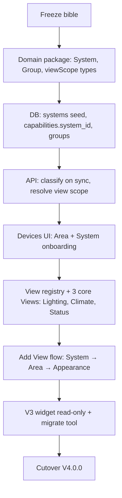

# Nexternel V4 — Development Bible Consistency Review

| Field | Value |
|-------|--------|
| **Document** | V4 Bible Consistency Review |
| **Product** | Nexternel |
| **Generation** | V4 |
| **Version** | V4.1.0 |
| **Status** | **Review artifact — update when bible docs change** |
| **Purpose** | Cross-check all planning documents against [07-DOMAIN-MODEL.md](07-DOMAIN-MODEL.md) before freezing the bible and starting implementation |

---

## 1. Review outcome (current)

| Area | Aligned? | Notes |
|------|----------|-------|
| Domain model | ✅ | [07-DOMAIN-MODEL.md](07-DOMAIN-MODEL.md) — approved |
| System catalogue | ✅ | [08-SYSTEM-CATALOGUE.md](08-SYSTEM-CATALOGUE.md) |
| View registry | 🟡 | [09-VIEW-REGISTRY.md](09-VIEW-REGISTRY.md) — evolving to Panel Registry; see [25](25-PANEL-ARCHITECTURE-RULES.md) |
| Capability standard | ✅ | [10-CAPABILITY-STANDARD.md](10-CAPABILITY-STANDARD.md) |
| UX ↔ Domain | ✅ | [18](18-DASHBOARD-UX-ARCHITECTURE.md), [06](06-USER-EXPERIENCE-AND-DESIGN-SYSTEM.md) |
| PRD V4 addendum | ✅ | [03-PRD.md](03-PRD.md) § V4 Addendum |
| SAS V4 addendum | ✅ | [04-SOFTWARE-ARCHITECTURE.md](04-SOFTWARE-ARCHITECTURE.md) § V4 SAS Addendum |
| Service layer (future) | ✅ | Reserved in 07 §2.4, 08 §8 |
| Automation as consumer | ✅ | 07 §2.3, 08 §6 |
| Phase / feature docs | 🟡 | Historical — mapped in §3 |
| Codebase | ❌ | V3.1.x until V4 implementation |

**Recommendation:** Complete **§7 sign-off** → **freeze bible** → implementation per §5.

---

## 2. Canonical vocabulary (single source: Domain Model)

| Use everywhere | Do not use (user-facing) |
|----------------|--------------------------|
| Home | Installation UUID |
| Area | Room (ok as synonym in UI copy) |
| System | Category, domain, function (mixed) |
| Group | — |
| Device | Board, ESP32 (default UI) |
| Capability | Entity, relay (default UI) |
| View / Panel | Widget |
| Panel scope | Widget scope, bindings list |
| Appearance | Widget type (`switch_icon`) |
| Driver | Protocol in dashboard |

---

## 3. Document-by-document alignment

### 3.1 Core bible (00–05)

| Doc | Role vs V4 | Action |
|-----|------------|--------|
| [00-MASTER-ARCHITECTURE-PLAN.md](00-MASTER-ARCHITECTURE-PLAN.md) | Generation 3 charter | Add **V4 addendum** pointer: domain model + Views supersede dashboard widget philosophy |
| [01-VISION.md](01-VISION.md) | Capability-first ✅ | Aligns — add sentence: Systems are user-facing capability owners |
| [02-COMPETITIVE-ANALYSIS.md](02-COMPETITIVE-ANALYSIS.md) | HA comparison | Update when marketing V4: System layer vs HA entity |
| [03-PRD.md](03-PRD.md) | WID-* widget reqs | **Amend:** Views, Systems, self-maintaining dashboards |
| [04-SOFTWARE-ARCHITECTURE.md](04-SOFTWARE-ARCHITECTURE.md) | Stack locked ✅ | **Amend:** domain services for System/Group; optional `POST /views/resolve`; Zustand still optional |
| [05-IMPLEMENTATION-MIGRATION-PLAN.md](05-IMPLEMENTATION-MIGRATION-PLAN.md) | V2→V3 migration | Add **V4 track:** V3 widgets → Views, capability `system_id` migration |

### 3.2 V4 foundation (06, 07, 18, 24)

| Doc | Status |
|-----|--------|
| [06-USER-EXPERIENCE-AND-DESIGN-SYSTEM.md](06-USER-EXPERIENCE-AND-DESIGN-SYSTEM.md) | **V4 UX authority** — View, Panel, View Scope |
| [07-DOMAIN-MODEL.md](07-DOMAIN-MODEL.md) | **V4 domain authority** — Home→Area→System→Group→Device→Capability |
| [18-DASHBOARD-UX-ARCHITECTURE.md](18-DASHBOARD-UX-ARCHITECTURE.md) | **V4 dashboard authority** — must reference Systems + viewScope |
| [24-V4-BIBLE-CONSISTENCY-REVIEW.md](24-V4-BIBLE-CONSISTENCY-REVIEW.md) | This document |

### 3.3 Phase implementation notes (06–13)

| Doc | V4 status |
|-----|-----------|
| [06-PHASE1-FOUNDATION.md](06-PHASE1-FOUNDATION.md) | Historical — scaffolds still valid |
| [07-PHASE2-BACKEND-API.md](07-PHASE2-BACKEND-API.md) | Historical — extend for System/Group routes |
| [08-PHASE3-4-TELEMETRY-CAPABILITIES.md](08-PHASE3-4-TELEMETRY-CAPABILITIES.md) | Historical — add system assignment to sync |
| [09-PHASE5-6-DASHBOARDS.md](09-PHASE5-6-DASHBOARDS.md) | **Superseded for UX** by 18 + 07 |
| [10-PHASE7-HISTORY.md](10-PHASE7-HISTORY.md) | Still valid — Charts View uses same Influx path |
| [11-PHASE8-ADMIN-PLUGINS.md](11-PHASE8-ADMIN-PLUGINS.md) | Amend — plugin Systems + Views |
| [12-PHASE9-CUTOVER.md](12-PHASE9-CUTOVER.md) | Historical |
| [13-PHASE10-RETIRE-NEXT.md](13-PHASE10-RETIRE-NEXT.md) | Still valid |

### 3.4 Feature docs (14–23)

| Doc | V4 action |
|-----|-----------|
| [14-UI-SKINS.md](14-UI-SKINS.md) | Valid — skins wrap Views |
| [15-DASHBOARD-SECTIONS.md](15-DASHBOARD-SECTIONS.md) | Amend — `roomId` → `areaId` in narrative; section scopes Area |
| [16-WIDGET-CATALOG.md](16-WIDGET-CATALOG.md) | **Superseded** — replace with View catalogue (Lighting Panel, …) |
| [17-ECHARTS-WIDGETS.md](17-ECHARTS-WIDGETS.md) | Maps to **Charts View** — appearance presets unchanged |
| [18-AREAS.md](18-AREAS.md) | Align with **Area** in domain model (same `rooms` table) |
| [19-DEVICES.md](19-DEVICES.md) | **Amend** — onboarding must set Area + System |
| [20-LIVE-SWITCH-IDLE.md](20-LIVE-SWITCH-IDLE.md) | Valid — capability behaviour |
| [21-GENERAL-WIDGETS.md](21-GENERAL-WIDGETS.md) | Maps to Weather/System/Camera **Views** |
| [22-DASHBOARD-TABS.md](22-DASHBOARD-TABS.md) | Valid |
| [23-ROLES.md](23-ROLES.md) | Valid — permissions on capabilities unchanged |

---

## 4. Stack decisions — unchanged (confirmed)

Per product owner review and domain model:

| Component | V4 |
|-----------|-----|
| Fastify API | ✅ Keep |
| React SPA + MUI | ✅ Keep |
| React Grid Layout | ✅ Keep (View **placement**) |
| Apache ECharts | ✅ Keep (Charts View) |
| Capability model | ✅ Keep + **system_id** |
| Device drivers | ✅ Keep |
| Telemetry / MQTT / WS | ✅ Keep |
| Plugin SDK | ✅ Keep + View + System registration |
| Dashboard JSON in Postgres | ✅ Keep + viewScope |
| PostgreSQL / Influx / Node-RED | ✅ Keep |

---

## 5. Implementation sequence (after bible freeze)

**Not authorized now.** Recommended order:

---

## 6. Open amendments (before freeze)

| # | Document | Amendment | Status |
|---|----------|-----------|--------|
| 1 | PRD | V4 Addendum | ✅ Done |
| 2 | SAS | V4 Addendum + domain pointer | ✅ Done |
| 3 | Master Plan | V4 generation paragraph | ✅ Done |
| 4 | 16-WIDGET-CATALOG | Deprecation banner | ✅ Done |
| 5 | 19-DEVICES | Area + System onboarding | ☐ Update in implementation |
| 6 | AGENTS.md | Point agents to 07–10 | ✅ Done |

---

## 7. Sign-off checklist

**Bible frozen 04/08/2026.** Implementation authorized on branch `v4.0.0-foundation`. See [V4-IMPLEMENTATION.md](V4-IMPLEMENTATION.md).

| Stakeholder | Domain model (07) | View UX (18) | UX system (06) | Bible freeze |
|-------------|-------------------|--------------|----------------|--------------|
| Product owner | ✅ | ✅ | ✅ | ✅ |
| Chief architect | ✅ | ✅ | ✅ | ✅ |
| Engineering lead | ✅ | ✅ | ✅ | ✅ |
| UX / design | ✅ | ✅ | ✅ | ✅ |

**Phase 1 (domain + DB, no UI) in progress.**

---

## 8. Version narrative

| Generation | Meaning |
|------------|---------|
| V2 | Next.js monolith era |
| V3 | Fastify + React SPA, capability sync, **entity-first dashboard** (shipped) |
| **V4** | **System-owned capabilities, Views, self-maintaining dashboards** |

Build numbers: `V4.0.0` first V4 release; `V4.1.0` when domain + core Views complete.

---

*Last updated: V4 frozen · Phase 1 foundation started.*
